<iframe width="100%" height="468" src="//player.bilibili.com/player.html?isOutside=true&aid=995248168&bvid=BV1ps4y1d73V&cid=1100442505&p=39"crolling="no" border="0" frameborder="no" framespacing="0" allowfullscreen="true"></iframe>

:::note
这一部分和操作系统第四章后半部分有较多重合，请结合学习。

其中，计组主要考察的是硬件特性，OS主要考察的是对磁盘的管理。如：调度算法。
:::

- ## 外部存储器
    - 磁盘存储器（Key：磁盘存取时间的计算）
    - 固态硬盘（SSD）

### 外存储器
当磁带划过磁头下方时，磁头就可以一比特比特地往里面写入数据，读数据也类似，只是一个通过读线圈，一个通过写线圈。

**每次只能读（写）一比特！**

基于该原理我们知道，读和写这两个动作是不可以同时进行的。

因此我们需要一个专门的串行并行电路将数据转化成`8bit`。
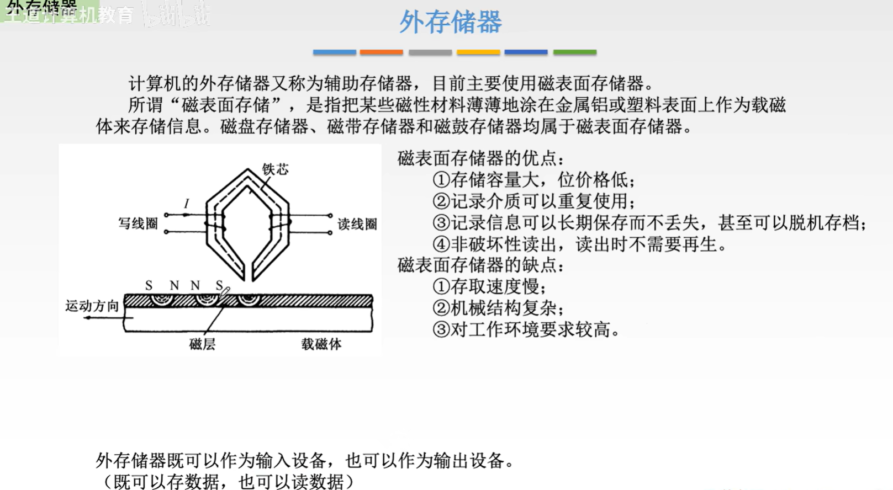

### 磁盘存储器
#### 磁盘设备的组成
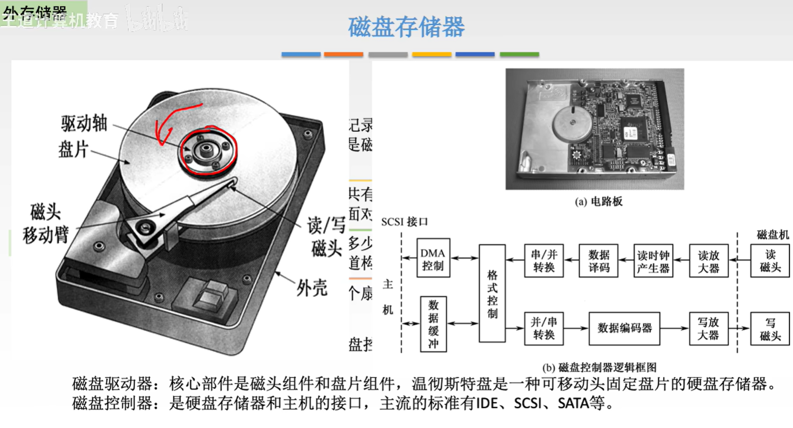
可以看到，左边的驱动轴会有一个马达，带动着磁盘往某一个方向旋转。

盘片表层会一圈圈地涂上磁性材质。

所以当我们想要读取某一圈的磁性材质里面的数据，需要移动移动臂到对应的那一圈磁性材质上。

又由于驱动轴会带动盘片旋转，使得这一圈的磁性材质从磁头臂的下方划过，磁头臂的头上会有一个读/写磁头，用来读取二进制的0和1。
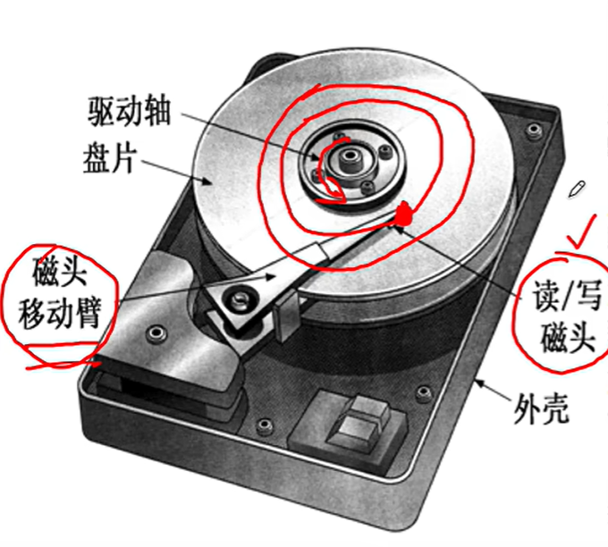

以上是磁盘的其中一面。

磁盘的另一面（背面）会有一个电路板，这些电路板其实就是磁盘的控制器。

我们可以把正面称为“机械部分”，背面称为“电子部分”。
 
通过磁盘控制器（电子部分）才可以和主机交换数据。

接下来我们把磁盘的结构细化。 
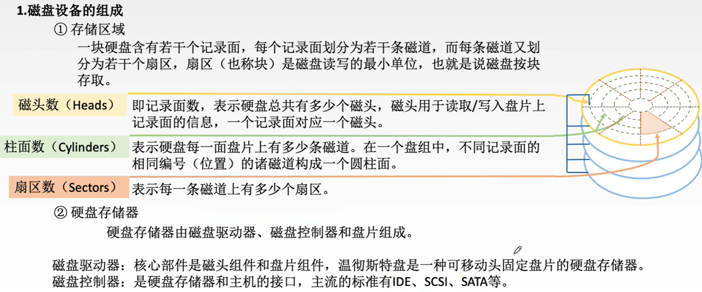
刚刚所谓的盘面的圈状的，每一圈磁性材料就叫**磁道**。

:::warning
主机每一次对磁盘进行读（写）操作，都是以扇区为单位的。

比如我需要读取一个扇区，就可以读取这个磁道的如图位置，让这一小段划过磁头的下方。
:::
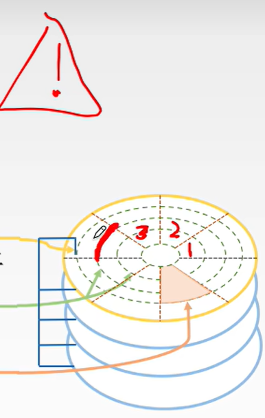

为了方便主机对磁盘数据的读写，因此需要把磁道划分成一个个更小的**扇区**，以扇区为单位对磁盘进行读（写）操作。 

由于有多个盘面，因此所有的这些盘面相对位置相同的磁道组成了一个**柱面**，当我们说柱面号的时候，其实就是在指明某一条磁道。
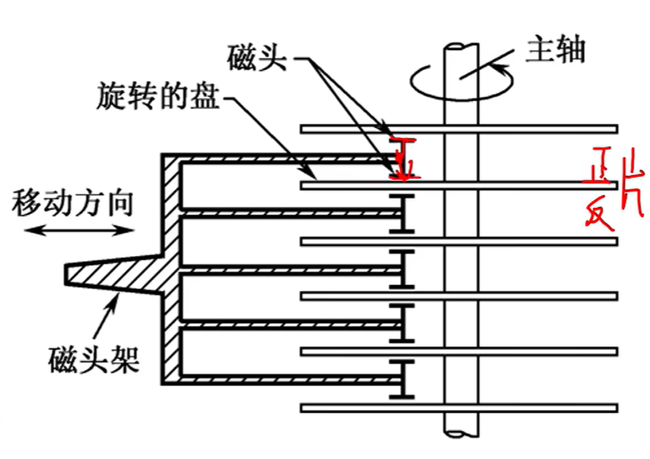

另外，在一个磁盘的盘片上，可以在它的正面和反面都涂上一圈圈的磁性材质。实际使用时经常会有这样的结构，一个磁头臂中有上面和下面两个读写磁头，最上面没有是造一个单向的不太划算的成本原因。 

#### 磁盘的性能指标
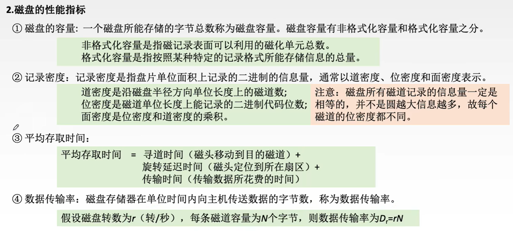
重点注意平均存取时间。
:::important
平均存取时间 = 寻道时间 + 旋转延迟时间 + 传输时间
::::
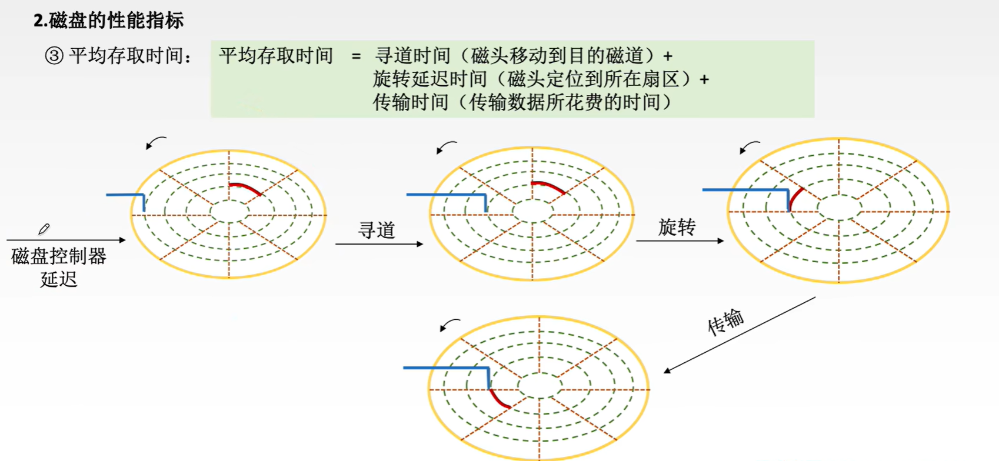
#### 磁盘地址和工作过程
 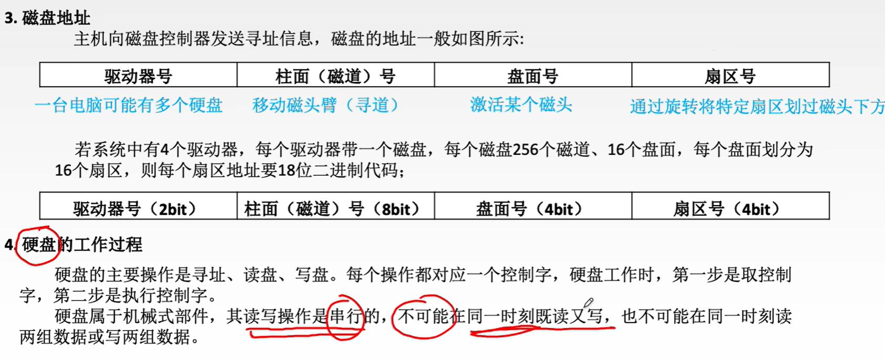
由于读和写只能一比特一比特地进行，因此对于磁盘的控制器来说，一定是需要添加一个串型转并型的变换电路。

主机给磁盘发送的数据可能是并行发送的，一次传入多个比特位。

当这些数据写入磁盘的时候，需要把并行的数据用串行的方式一比特一比特地写入。

读出也是一样，通过读写磁头读出数据后，一比特一比特（串行）方式读出，给系统总线发送的数据也许需要并行的发送，因此需要串行转并行的变换电路。
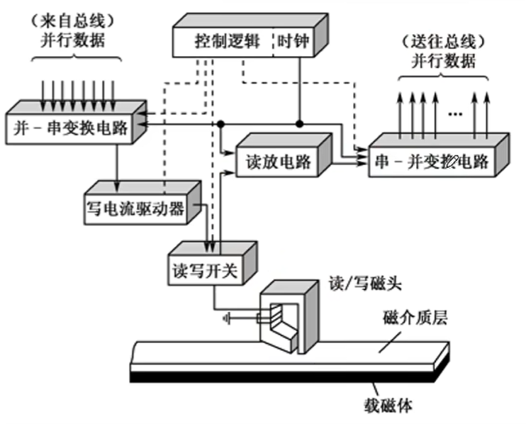

### 磁盘阵列
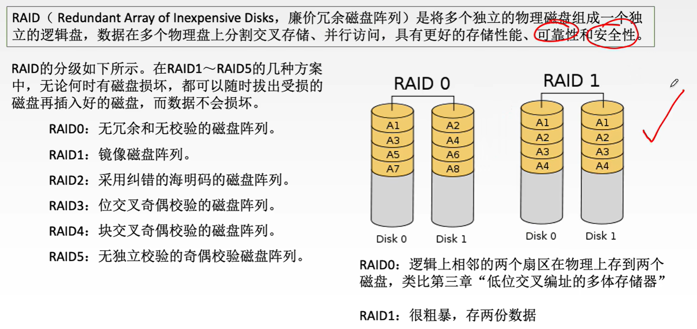
RAID0：无冗余和无校验的磁盘阵列。类似“低位交叉编址的多体存储器”。

:::note
无冗余和无校验，意外着扇区损坏时无法恢复数据，或检验数据是否发生跳变（0变1，1变0等）。
:::
RAID1：有冗余有校验，镜像磁盘阵列。
RAID2：采用纠错的海明码的磁盘阵列，可纠正一位错误，发现两位错误。
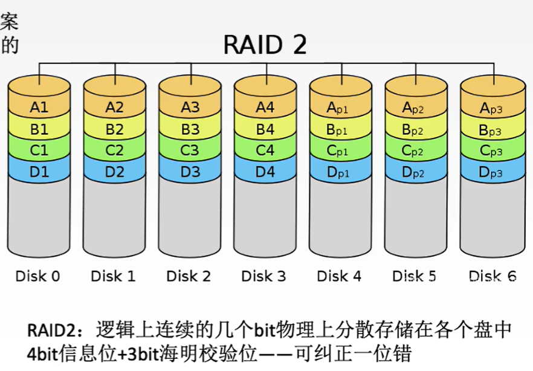
RAID3，4，5就不做具体介绍了，只需知道从上至下可靠性会越来越高，越安全，且相对于RAID1冗余信息较少。
重点区分RAID0，RAID1。
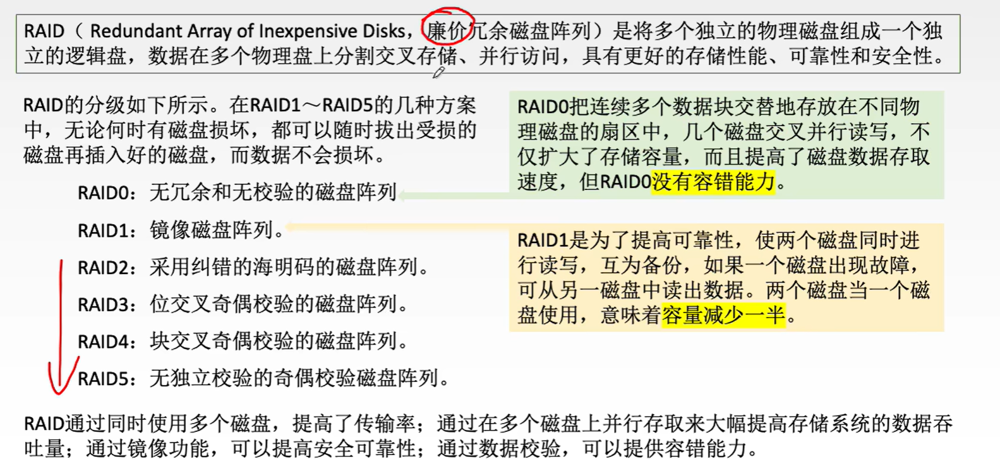 

---

###  知识回顾

---
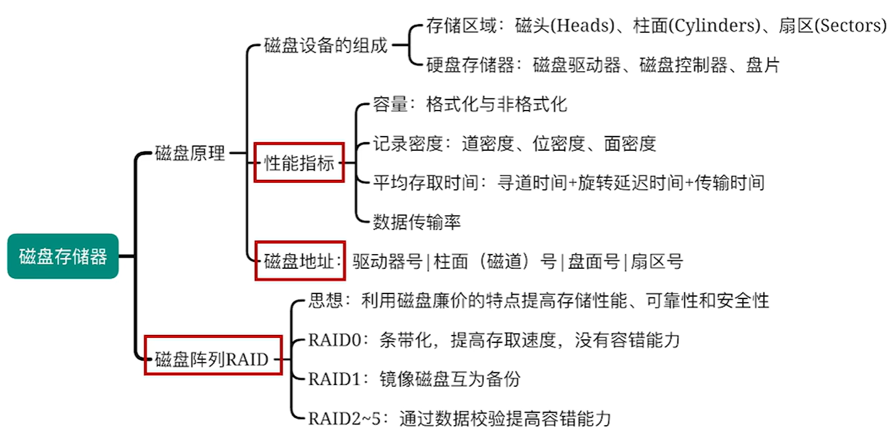