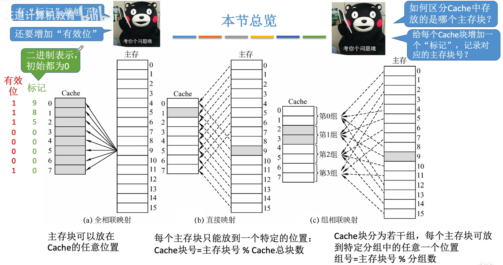
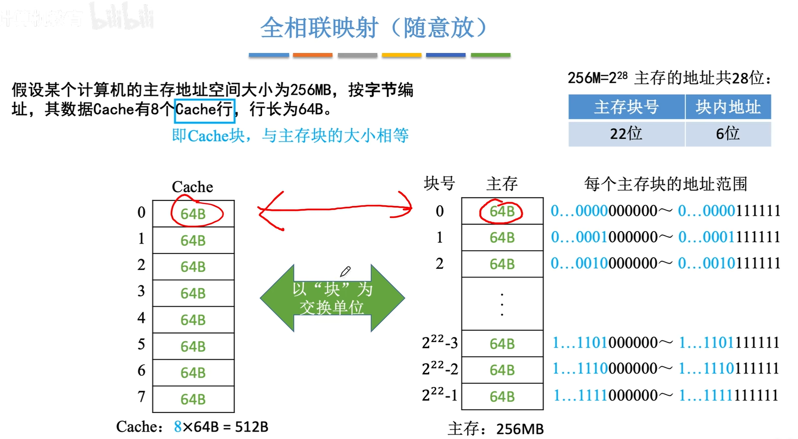
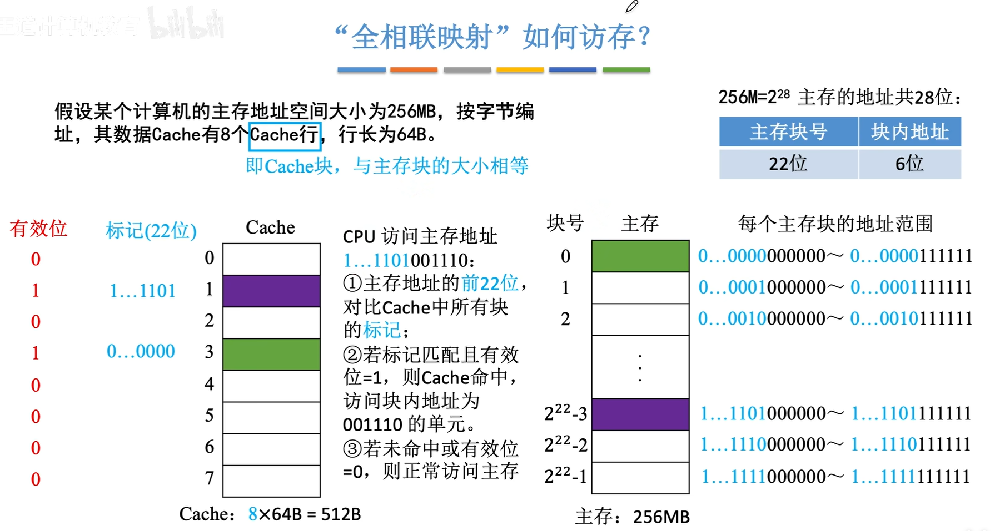
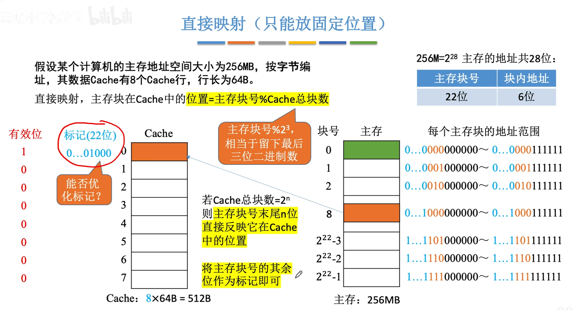
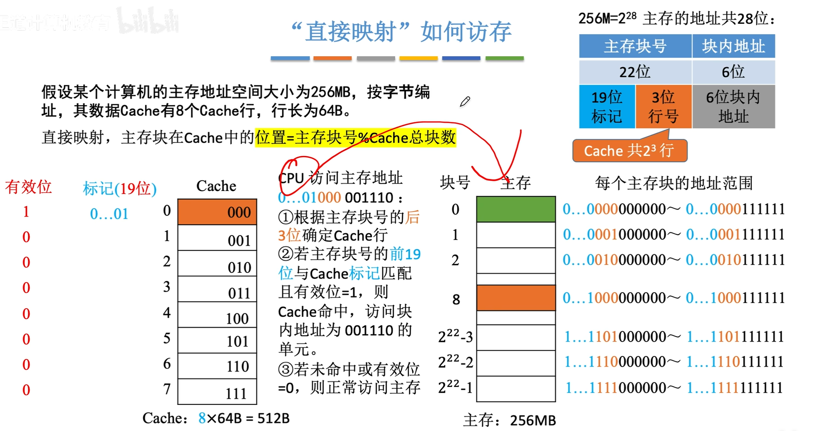
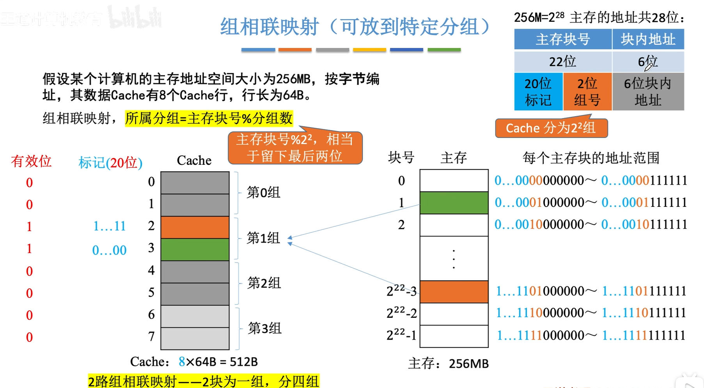
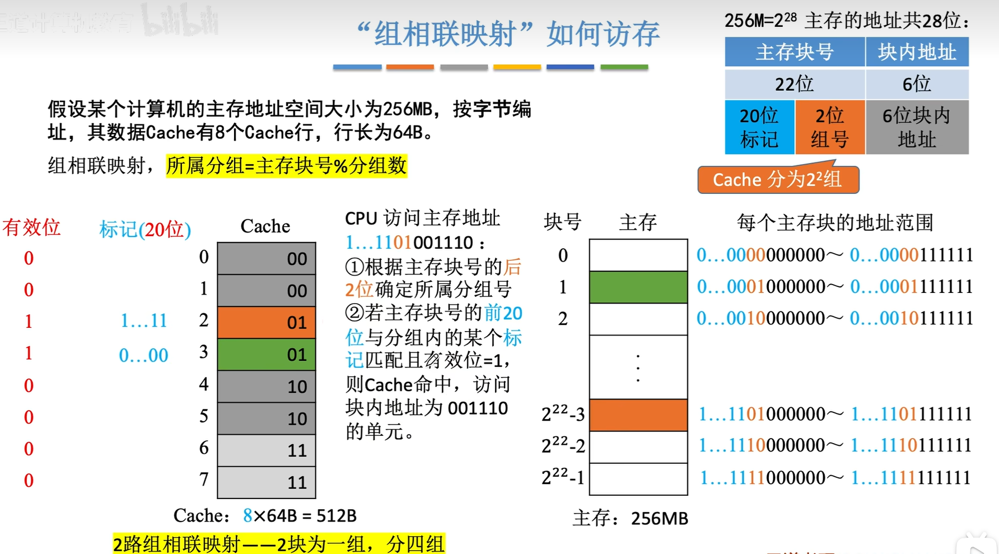
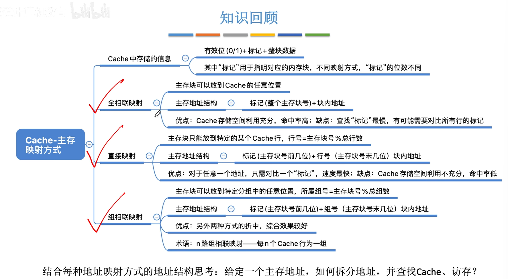

<iframe width="100%" height="468" src="//player.bilibili.com/player.html?isOutside=true&aid=995248168&bvid=BV1ps4y1d73V&cid=1100443254&p=42"  crolling="no" border="0" frameborder="no" framespacing="0" allowfullscreen="true"></iframe>

- ## Cache-主存映射方式
    - Cache中存储的信息
    - 全相联映射
    - 直接映射
    - 组相联映射

### 全相联映射（随意放）

### 直接映射（只能放固定位置）

优化：根据位置=主存块号%Cache总块数，能保存在0号Cache块的数据，对应的主存块的地址末三位也一定是000，因此不需要保存，其他位同理。

### 组相连映射（可放到特定分组）

---

###  知识回顾

---

