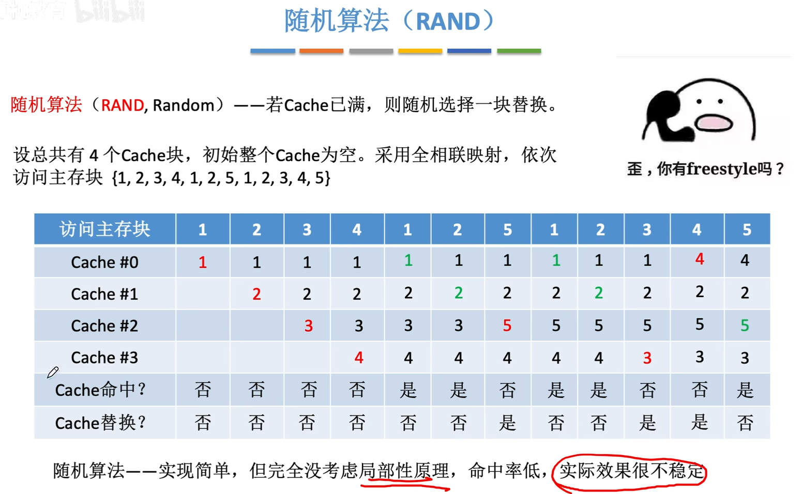
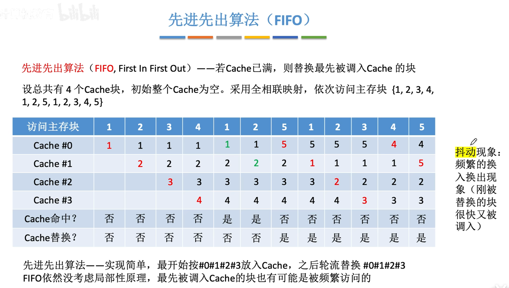
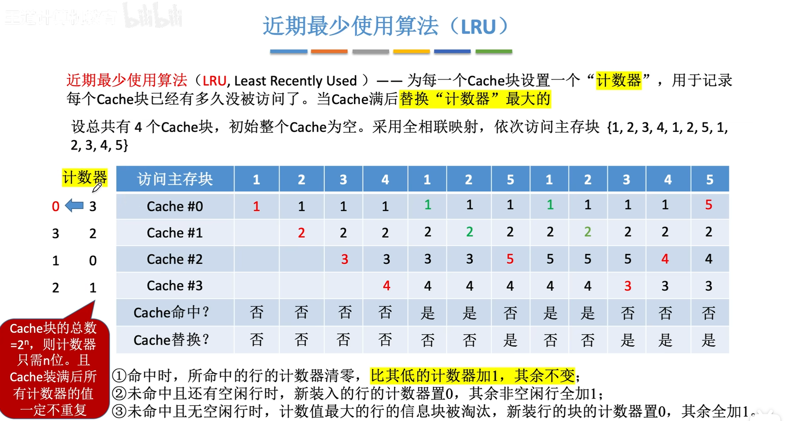
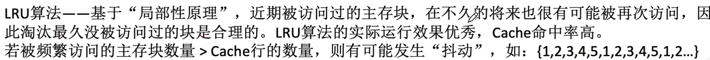
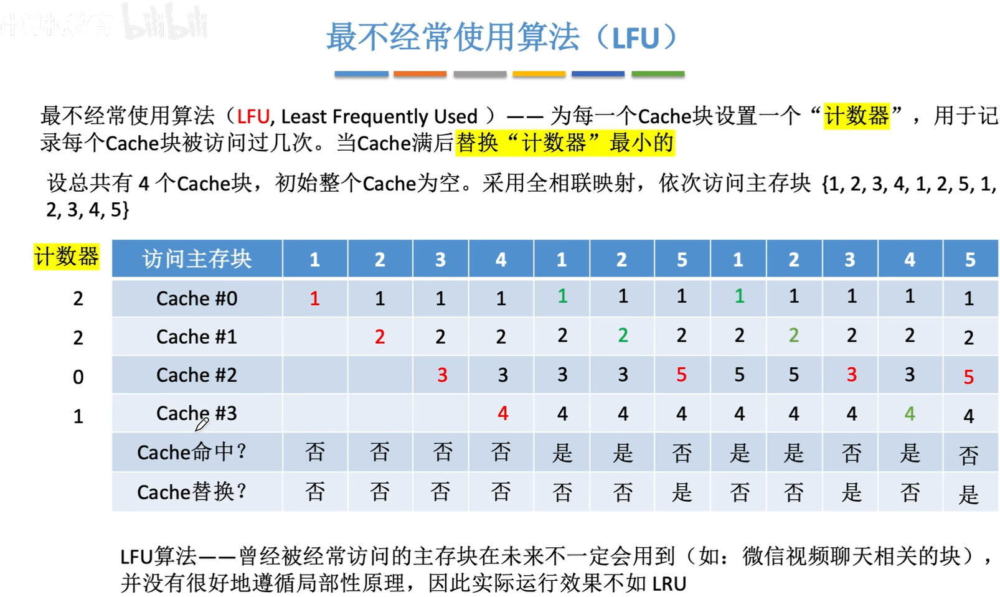
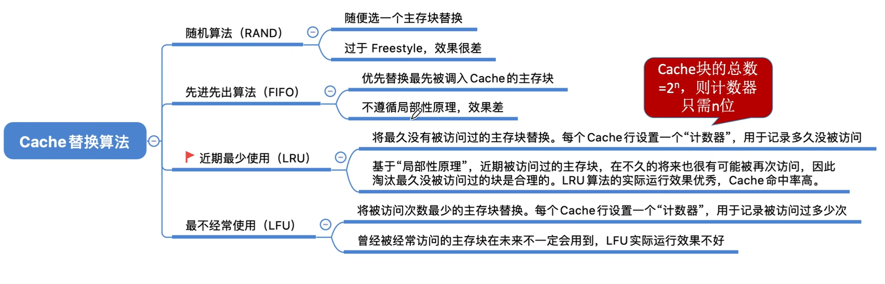

<iframe width="100%" height="468" src="//player.bilibili.com/player.html?isOutside=true&aid=995248168&bvid=BV1ps4y1d73V&cid=1100443570&p=43"crolling="no" border="0" frameborder="no" framespacing="0" allowfullscreen="true"></iframe>

- ## 替换算法
    - 随机算法（RAND）
    - 先进先出算法（FIFO）
    - 近期最少使用（LRU）
    - 最近不经常使用（LFU）

###  随机算法（RAND）

 
###  先进先出算法（FIFO）

###  近期最少使用算法（LRU）

  
:::warning
Cache命中时，只需要比命中行低的计数器+1，其余不变。

好处是保证了计数器只需n位。
:::

###  最不经常使用算法（LFU）

 

---

###  知识回顾

---
