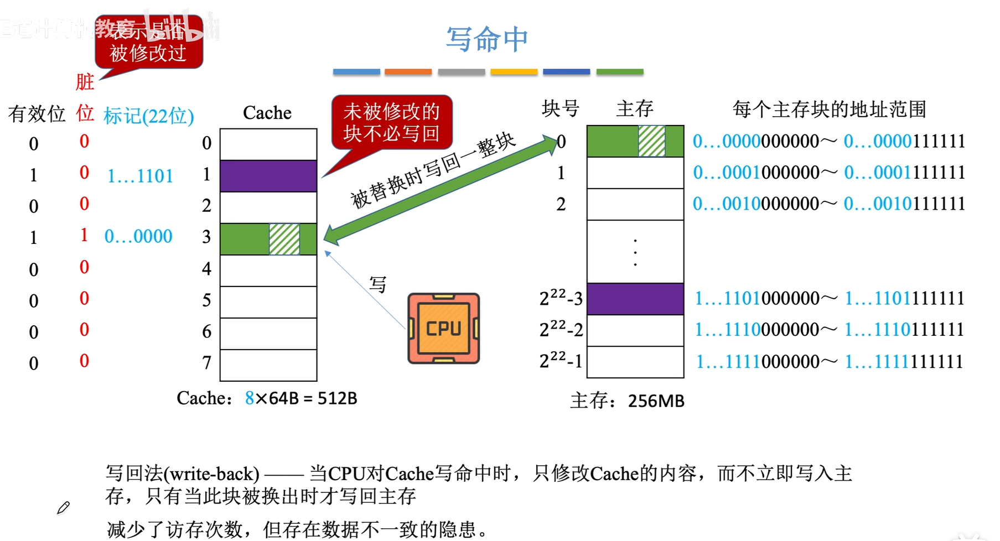
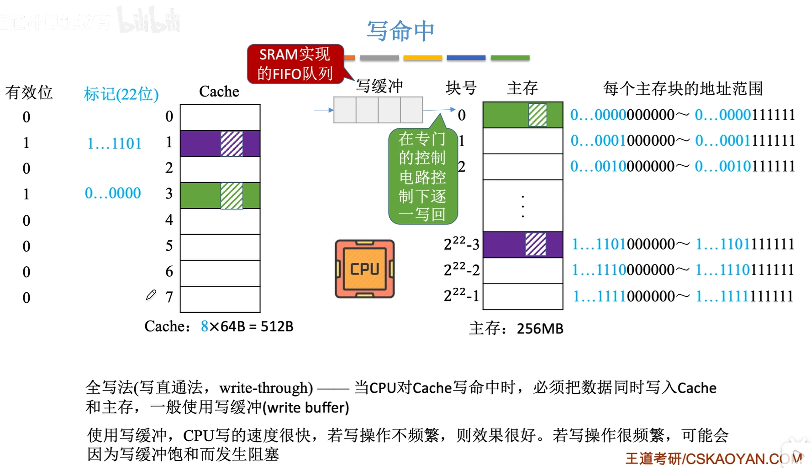
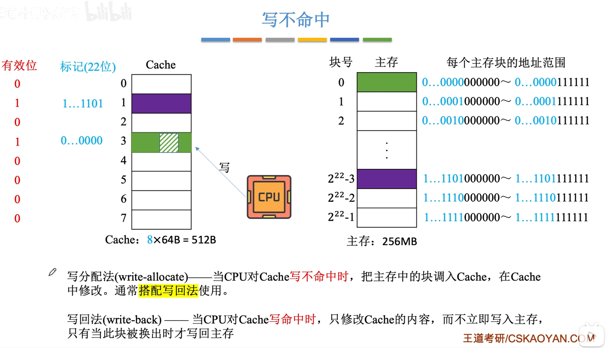
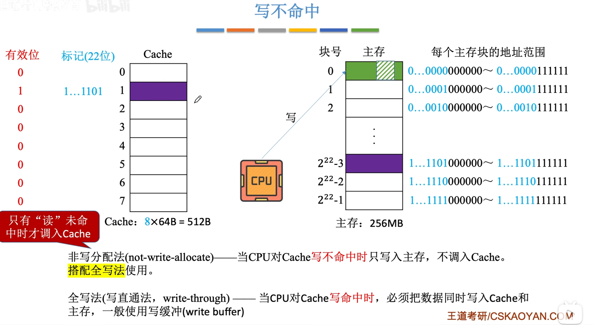
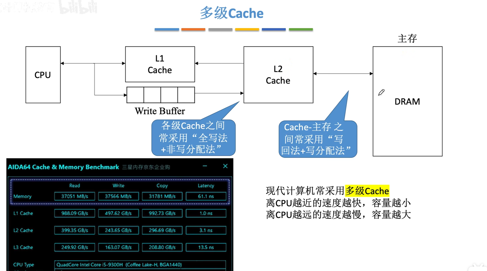
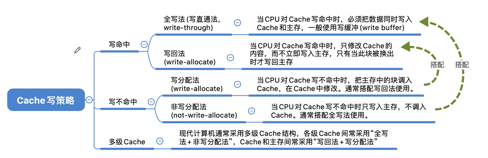

<iframe width="100%" height="468" src="//player.bilibili.com/player.html?isOutside=true&aid=995248168&bvid=BV1ps4y1d73V&cid=1100444195&p=44"crolling="no" border="0" frameborder="no" framespacing="0" allowfullscreen="true"></iframe>

- ## Cache写策略
    - 写命中（全写法和写回法）
    - 写不命中（写分配法和非写分配法）

:::note
为何不讨论读命中、读不命中的情况？

**读操作不会导致Cache和主存的数据不一致**
:::

###  写命中
#### 写回法

#### 全写法（写直通法）

 
###  写不命中
#### 写分配法

搭配写回法使用。

#### 非写分配法

搭配全写法使用。

###  多级Cache

---

###  知识回顾

---

