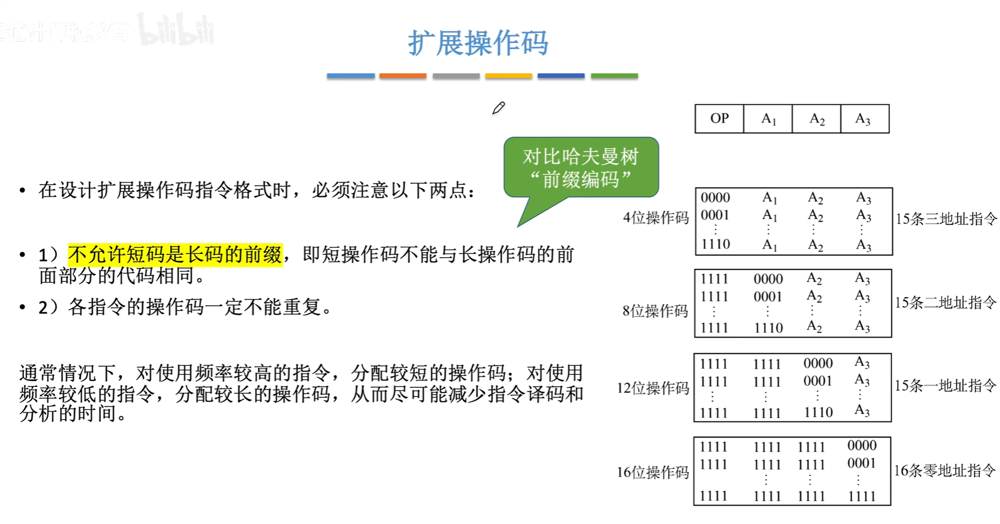

<iframe width="100%" height="468" src="//player.bilibili.com/player.html?isOutside=true&aid=995248168&bvid=BV1ps4y1d73V&cid=1100480292&p=45"crolling="no" border="0" frameborder="no" framespacing="0" allowfullscreen="true"></iframe>

- ## 指令格式
    - 操作码、地址码的概念
    - 根据地址码数目不同分类
    - 根据指令长度分类
    - 根据操作码的长度不同分类
    - 根据操作类型分类

:::note
这一章主要探讨控制器相关的指令如何设计。
:::

###  指令-按地址码数目分类

#### 零地址指令

#### 一地址指令

#### 二、三地址指令

#### 四地址指令
 
###  指令-按指令长度分类

指令长度指是机器字长的多少倍。

###  指令-按操作码长度分类

###  指令-按操作类型分类

---

###  知识回顾

---

###  扩展操作码指令格式

:::note
编码部分可以和哈夫曼树“前缀编码”进行对比学习。
:::

:::warning
短的操作码不能是长的操作码的前缀，否则在译码阶段容易出现歧义
::: 