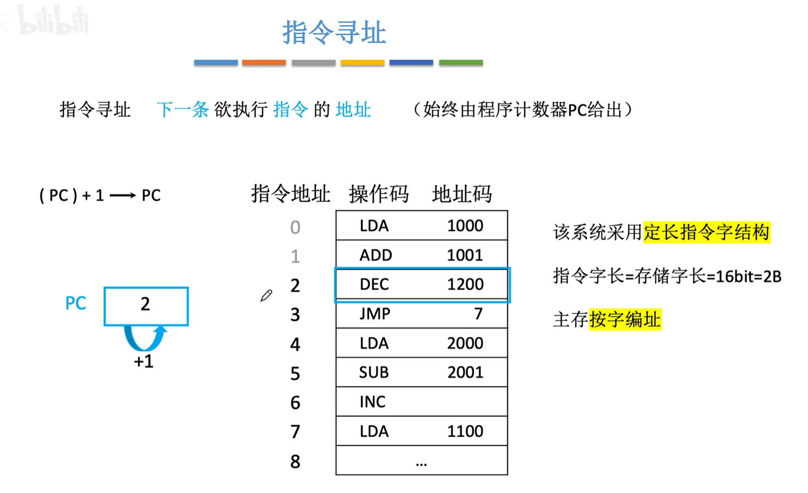
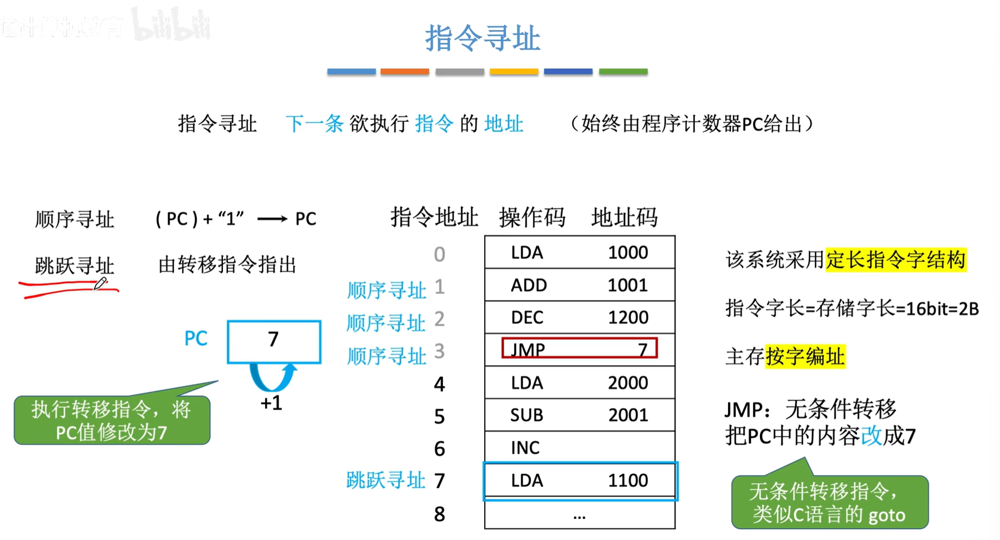
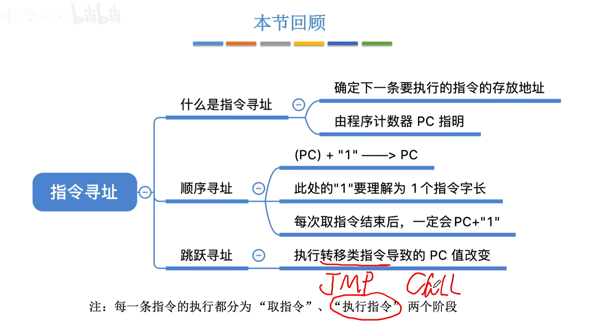

<iframe width="100%" height="468" src="//player.bilibili.com/player.html? isOutside=true&aid=995248168&bvid=BV1ps4y1d73V&cid=1100444195&p=44"crolling="no" border="0" frameborder="no" framespacing="0" allowfullscreen="true"></iframe>

- ## 指令寻址
    - 顺序寻址
    - 跳跃寻址

:::note
指令寻址，是下一条欲执行指令的地址，**始终由程序计数器PC给出**。
:::

###  顺序寻址

改变条件，假设主存按字节编址。

:::note
(PC)加的"1"理解为1个指令字长。
:::
    
###  跳跃寻址

JMP（Jump）：无条件转移指令。

:::note
JMP，Call这些指令属于转移类指令，会改变程序的执行流。

换言之，会直接修改PC的值。
:::

---

###  知识回顾

---

