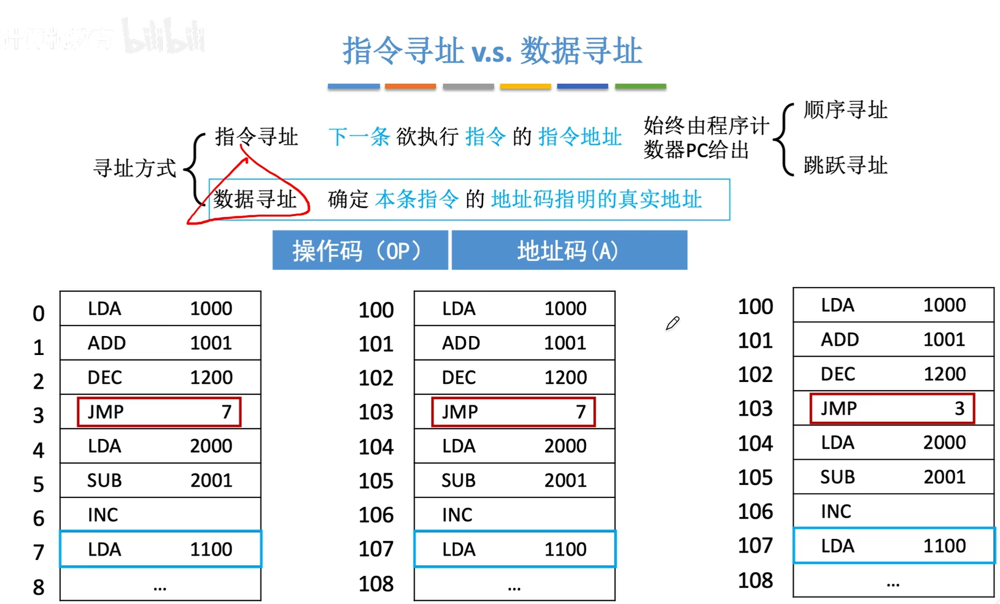
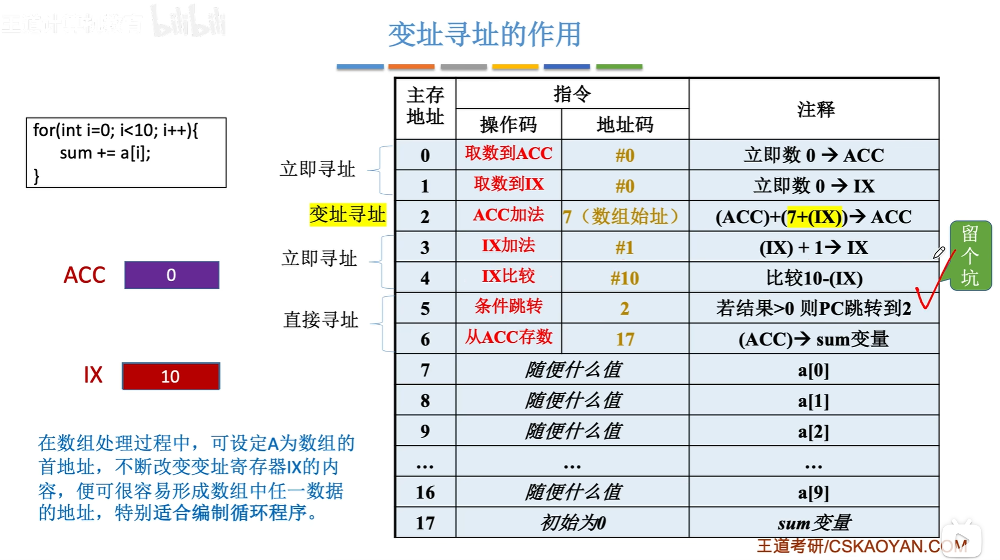
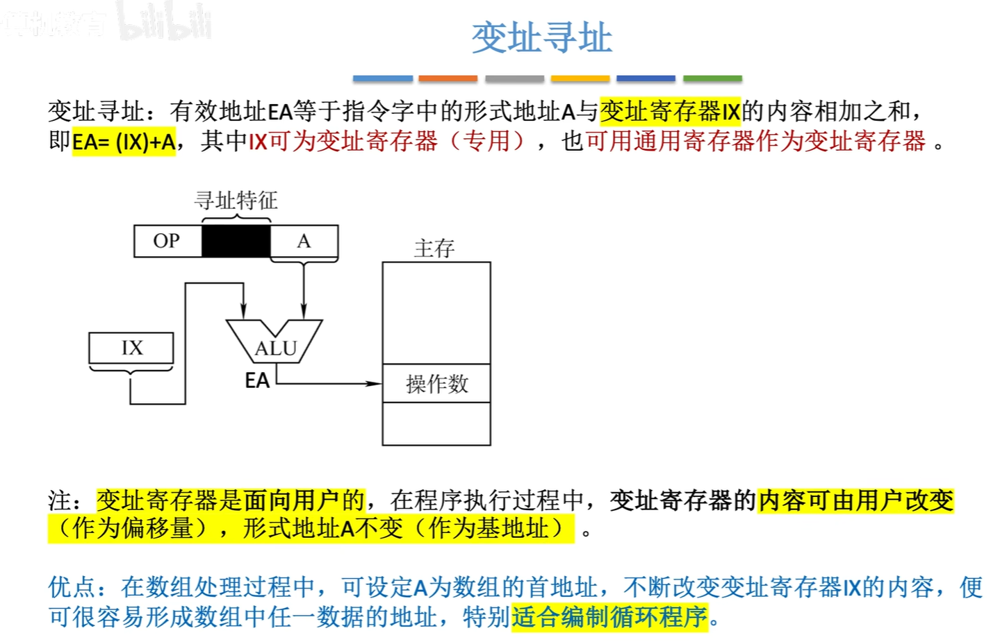

<iframe width="100%" height="468" src="//player.bilibili.com/player.html?isOutside=true&aid=995248168&bvid=BV1ps4y1d73V&cid=1100485288&p=48" crolling="no" border="0" frameborder="no" framespacing="0" allowfullscreen="true"></iframe>

- ## 数据寻址
    - 顺序寻址
    - 跳跃寻址

在之前的学习中，我们知道JMP指令会让CPU把PC（程序计数器）的值改为7，意味着接下来要执行的指令存放在主存地址为7的这个地方。

对于JMP这个指令来说，它的地址码所指向的就是真实的一个地址。

还能发现，这段代码是从主存地址为0的这个单元开始往后存储的，刚好JMP指令想要跳转到的那一条指令的地址就是7这个地址。

所以把PC的值直接改为7，并不会导致这个程序的运行错误。

但是我们知道计算机的主存同一时刻可能存在很多个程序正在并发地运行，意味着我们不可能保证当前我们要运行的这个程序一定可以从地址为0的这个地方开始存储。

所以假设我们要运行的这段程序是从主存地址为100的地方开始存储，
对于JMP这个指令来说，它的地址码的含义就会出现错误。

如果我们依然是按照之前的那种解释方式来解读这个地址码的真实含义的话，那CPU执行到这条指令的时候，意味着跳转到地址为7的地方运行指令，这显然是错误的。

那么对于这个例子，我们应该如何解读这个地址码7的含义呢？

可以这么来看，由于我们的代码起始地址是100，这个7我们可以看为基于这个起始地址往后的一个偏移量。

也就是这个地址的含义应该是100+7=107。

:::note
对于一条指令所包含的地址码，我们不能简单粗暴地认为这个地址码指向的就是一个真实的地址。

有的情况下，我们需要改变对这个地址码的解读方式。
:::

那如果是3应该如何解读呢？由于PC会在指令结束后自动+1，从PC所指的地址往后偏移3个单位。 

:::note
这两种寻址方式都是以某个地址作为起点，形式地址视为“偏移量”。
:::
 
数据码的解读方式可能有很多种，我们如何区分一条指令的地址码应该用什么方式解读呢？

通常来说，可以在地址码的前边加上这样的几个比特位，用来标识地址码采用的寻址方式。

求出操作数的真实地址，称为有效地址（EA），指令里包含的形式地址，用单独的一个A来表示。

###  直接寻址

    
###  间接寻址

###  寄存器间接寻址

###  隐含寻址

###  立即寻址

:::warning
注意区分立即寻址和直接寻址。

直接寻址是直接去找这个形式地址所指明的主存单元。
:::

 
---

###  知识回顾

---

:::warning
本表格的访存次数排除了取指令所需要的那一次缓存操作。
:::

## 偏移寻址

<iframe width="100%" height="468" src="//player.bilibili.com/player.html?isOutside=true&aid=995248168&bvid=BV1ps4y1d73V&cid=1100485354&p=49" crolling="no" border="0" frameborder="no" framespacing="0" allowfullscreen="true"></iframe>

:::note
不同偏移选址的区别在于偏移的”起点“不一样。
:::

### 基址寻址

### 变址寻址

:::note
变址寄存器里的值是可以采用指令的方式修改的，这和基址寄存器不一样。
:::

### 基址&变址复合寻址

 

### 相对寻址

 :::note
 基址寻址中说的浮动，是在内存中的浮动。而相对寻址中说的浮动，指的是一段代码在程序内部的浮动。
 :::

 ---

###  知识回顾

---

##  硬件如何实现”数“的比较

    
