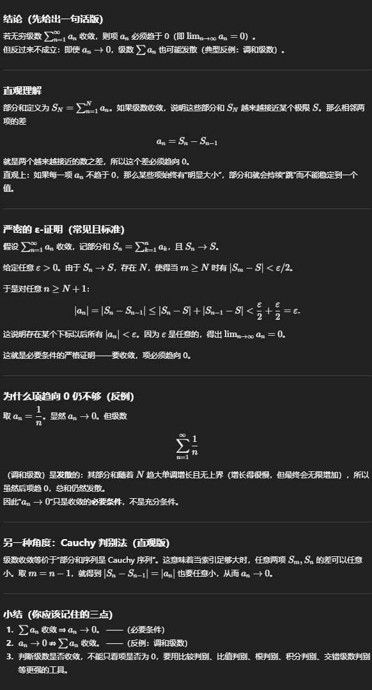
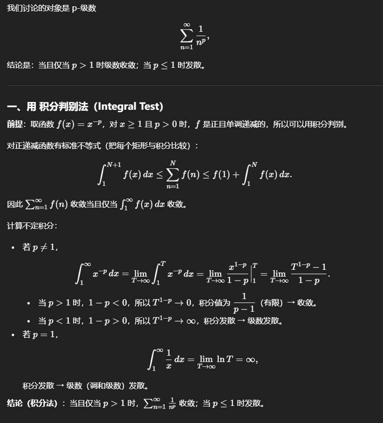
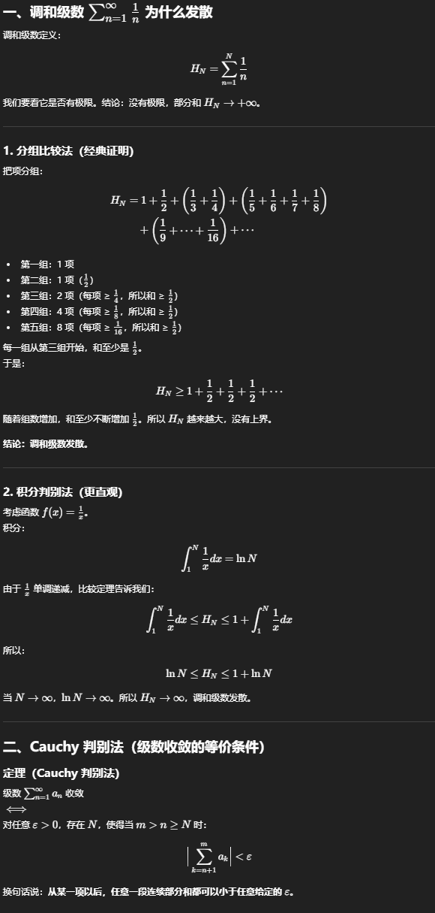
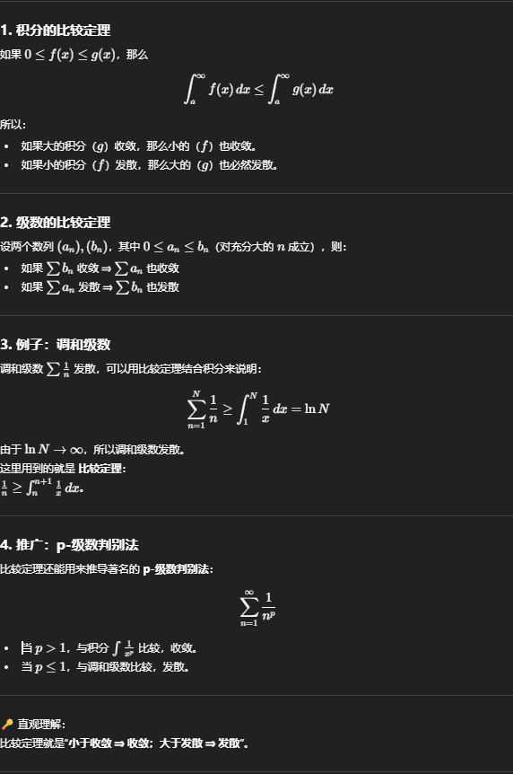

# 無限級数の収束性と p 級数の判定法

## 1. 基本性質：級数が収束すると項は 0 に近づく
無限級数

$$
\sum_{n=1}^\infty a_n = S
$$

が収束するとする。部分和

$$
S_N = \sum_{n=1}^N a_n
$$

が極限 $S$ に収束する場合、

$$
a_n = S_n - S_{n-1} \to S - S = 0
$$

> 結論：級数が収束する場合、項 $a_n$ は 0 に近づく。

注意：逆は成り立たない。例えば調和級数 $\sum 1/n$ は項が 0 に近づくが、級数は発散する。

---

## 2. 調和級数
調和級数：

$$
\sum_{n=1}^\infty \frac{1}{n}
$$

は代表的な発散級数である。  
積分比較法により証明できる：

$$
\sum_{n=1}^N \frac{1}{n} \ge \int_1^N \frac{1}{x}\,dx = \ln N \to \infty
$$

---

## 3. Cauchy の収束判定法
級数 $\sum a_n$ が収束するのは次の条件と同値である：

任意の $\varepsilon > 0$ に対し、ある $N$ が存在して、全ての $m>n>N$ に対して

$$
|a_{n+1} + a_{n+2} + \cdots + a_m| < \varepsilon
$$

が成り立つ。

> 部分和列 $\{S_n\}$ が Cauchy 列であること ⇔ 収束。

---

## 4. 比較判定法
正の単調列 $a_n, b_n$ が存在して、十分大きな $n$ に対して

$$
0 \le a_n \le b_n
$$

が成り立つ場合：

- $\sum b_n$ が収束するなら $\sum a_n$ も収束  
- $\sum a_n$ が発散するなら $\sum b_n$ も発散

---

## 5. p 級数
p 級数は

$$
\sum_{n=1}^\infty \frac{1}{n^p}, \quad p\in \mathbb{R}
$$

で定義される。

結論：

$$
\sum_{n=1}^\infty \frac{1}{n^p} \text{ は収束 } \iff p>1
$$

$$
\sum_{n=1}^\infty \frac{1}{n^p} \text{ は発散 } \iff 0<p\le 1
$$

---

### 5.1 積分判定法による証明
関数 $f(x) = x^{-p}$ は $[1,\infty)$ 上で連続、単調減少、非負である。積分判定法により：

$$
\sum_{n=1}^\infty f(n) \text{ は } \int_1^\infty f(x)\,dx \text{ と同じ収束性を持つ}
$$

#### (1) $p>1$ の場合
$$
\int_1^\infty \frac{1}{x^p} \, dx
= \lim_{t\to\infty} \frac{x^{1-p}}{1-p}\Big|_1^t
= \lim_{t\to\infty} \frac{t^{1-p}-1}{1-p} = \frac{1}{p-1} < \infty
$$

> 収束

#### (2) $p=1$ の場合
$$
\int_1^\infty \frac{1}{x}\,dx = \lim_{t\to\infty} \ln t = \infty
$$

> 発散（調和級数）

#### (3) $p<1$ の場合
$$
\int_1^\infty \frac{1}{x^p}\,dx = \lim_{t\to\infty} \frac{t^{1-p}-1}{1-p} = \infty
$$

> 発散

---

### 5.2 Cauchy 圧縮検証
正の単調減少列 $a_n$ に対して

$$
\sum_{n=1}^\infty a_n \text{ は } \sum_{k=0}^\infty 2^k a_{2^k} \text{ と同じ収束性を持つ}
$$

$p$ 級数の場合 $a_n = n^{-p}$ とすると：

$$
\sum_{k=0}^\infty 2^k a_{2^k} = \sum_{k=0}^\infty 2^k \cdot (2^k)^{-p} = \sum_{k=0}^\infty 2^{k(1-p)}
$$

これは等比級数で、公比 $r = 2^{1-p}$：

- $p>1$ のとき $r<1$ → 収束  
- $p \le 1$ のとき $r \ge 1$ → 発散

> 積分法と同じ結論

---

## 6. まとめ
- 項が 0 に近づくことは収束の必要条件  
- 調和級数は項が 0 でも発散  
- Cauchy 判定法は級数の根本的判定  
- 比較判定法は既知級数との比較で便利  
- p 級数は $p>1$ で収束、それ以外は発散

