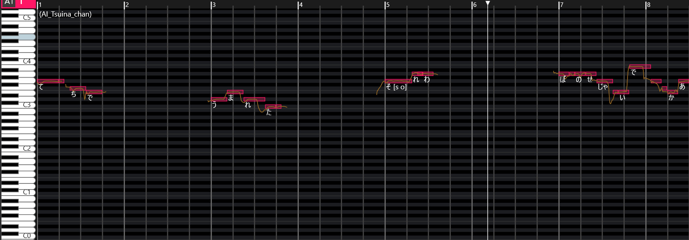
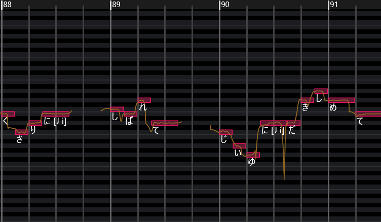
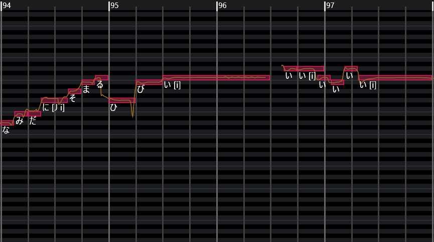
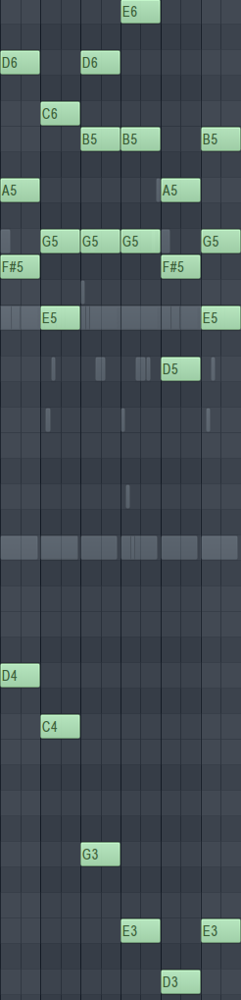
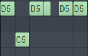
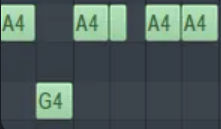

## くさり（鎖）创作过程

好久不见，最近很久没更新博客，主要在复习C#准备参加Gamejam，所以就没有学新的东西，不过心情实在一般（备考过猛反噬了hh），所以开始重拾乐理了。

我花了大概两天的时间从构思到完成这部曲子。第一天完成了这篇曲子的人声旋律、副歌以及作词，第二天则完成了全部的编曲。

您可以通过网易云音乐倾听这首歌的人声版或纯音乐版，网址如下：
- [くさり（鎖）](https://music.163.com/#/song?id=2751094419&uct2=U2FsdGVkX188ahQoyZfK8EkvzX/Dl44deneGcDzV3Qc=)
- [くさり（Acoustic）](https://music.163.com/song?id=2751103608&uct2=U2FsdGVkX19/4jP+Q/NJZlrrF7CilndWtkIlgo9Pa40=)

以下是我的一些创作经历。

---

### 🎤 人声

首先我选择了 **C5 作为根音**，没什么特别的原因，只是因为我喜欢容易演唱的流行旋律。  
在创作前我回顾了自己的大学生涯，以及即将踏上的未知的日本留学之旅，心中有非常多的感情。  
因此在作曲中比起单纯的旋律，我同时考虑的是 **旋律与作词是否搭配**。

> 低地で生まれた  
> それは僕のせいじゃないだろう  
> なぜ毎日 「出身」という名前の鎖に  
> 縛られて生きているのか

这是一直萦绕在我心中的打不开的结，因此几乎是脱口而出。

出生在中国的人，在世界中到处流浪讨生活。那不敢提及的出身，像一道枷锁一样，留学之后会改变掉吗？我不知道。而留学的结局，能获得的仅仅是发达国家的人天生就有的事物。多么悲伤的事情。



副歌之前的主歌部分几乎在十几分钟内写成，节奏比较慢，每个小节会停顿4拍。我想表达的是：  
- 因为自己的 **中国出身**，未来可能遭遇的困难  
- 在困难中曾经历过的迷茫  
- 以及未来这些因素会如何影响我

副歌部分我花了很久思考。tsuina（voicebank）的音色是我喜欢的日本甜妹感，因此我希望曲子整体呈现 **流行摇滚的日系风格**，旋律几乎都控制在前五个音内。
所幸得到了一个能听的旋律（尽管很短，而且只能容纳四个字），同时跟我希望表达的感情基调很搭配，读起来也朗朗上口。


为了使整体不那么单调,我加入了两个高音部分（副歌的变体）作为情绪的爆发点,这种突然的三连续高音以及颤音,是我在听歌中一直比较喜欢的部分,因此使用了进去。同时我也对重音做了自然化处理，使得tsuina的机械音不会太刺耳。



原本在高音之中伴奏全部消失是会留下一个比较空灵的结尾,不过如果这样结束我觉得有点可惜,因此又加上了一段比较好听的第三种副歌变体来丰富听感,这也是这首歌的主题,因此放在结尾是一个直接的提示主题的方法。

“在这个世界上，我到底该怎么办才好呢？”——这是歌曲核心的疑问。希望这首充满力量感的歌，也能成为您面对困境时的一点动力。

> 我希望表达的是，像我这样的中国人该如何在世界上生存下去。

---

### 🎸 和弦与编曲

**整首歌的吉他和弦走向**：

```text
Gmaj → Em → Dmaj → Cmaj/E

```

这是一个非常典型且流行的走向，广泛出现在 **流行音乐、电音、R&B** 等风格中，能够营造 **流畅、带动力且略带忧郁** 的氛围。  
同时，它也能确保 Vocaloid 的人声旋律与和弦在调性上的一致性。  

- 当主旋律中的 **C5 (Do)** 出现在 **Cmaj (I)** 和弦上时，能获得最大的稳定感  
- 而当 **Gmaj (V)** 出现时，旋律会产生强烈的推动力  



#### 功能对照表

| 和弦  | C 调中的功能 | 作用 |
|-------|-------------|------|
| Gmaj | V (属和弦) | 强烈导向 C (I)，为旋律创造紧张感 |
| Em   | iii (中音小和弦) | 柔和的色彩，与 C 调的主音功能相近 |
| Dmaj | V/V (二级属和弦) | 导向 G (V) 的桥梁，增加和声推动力 |
| Cmaj | I (主和弦) | 稳定、放松，旋律的主音 C 在此获得完全的稳定 |

由于使用了 **离调和弦 (II = V/V)** 的卡农和弦变体，整体和声更具推动力和色彩。  

在副歌部分，我加入了另外一把吉他，专门演奏和弦的根音。  
两个吉他叠加在一起，形成了一个还不错的协同效果。  

#### 节奏与低音
- **低音部分**：我选择了 Bass 鼓和 Drampad 敲击和弦根音，让前奏不那么单调。  
- **中段部分**：我让 Tom 鼓持续敲击 C 和弦，营造出 **递进的节奏感**，推动情绪层层上升。  

另外，为了使旋律不那么单调以及过渡自然，我使用了非常多的弦乐作为人声的补充，音色非常优雅，同时大部分来源于主旋律做出的一些变化，强化了主旋律的记忆点。

比如这段弦乐其实就源自于B段中“なぜ毎日”这一句的低音变调，使用三连音增加了跃动感。



---

### 🎚️ 混音

我没有进行过多的混音，因为这是一首快速做成的曲子，我希望它保留着它现在的样子。  

---

### 🎬 结语

或许未来某一天，我会把它做得更完整。  
尽管现在只是个半成品，但也能获得一些倾听的乐趣。  

无论如何，九月已经结束。  
感谢为自己深爱的事物勇敢追求的自己。

最后附上中日翻译对照版本的歌词。

```text
低地で生まれた
生在洼地

それは僕のせじゃないでしょうか
那不是我的错吧

なぜ毎日「出身」という名前の鎖に
为何每日被名为“出身”的锁链

縛れて生きるのか
被束缚着活着呢

飛行機で動いた
飞机发动起来

これが僕らの希望でしょうか
这是我们的希望吗

なぜ毎回 希望という呼べる物探して
为何每回 寻找着可以称之为希望的东西

呼ばれて生きるのか
被呼唤着活着呢

そだな、生きて
是啊，要活下去

そだね、生きれる
是吧，能活下去

鎖に縛れて
被锁链束缚着

自由に抱きしめて
一边拥抱自由

鎖に縛れて
被锁链束缚着的

涙で染まる日々
是用泪水浸染的往日

飛行機で動いた
飞机发动起来

これが僕らの希望でしょうか
这是我们的希望吗

なぜ毎回希望という呼べる物探して
为何每回寻找着可以称之为希望的东西

呼ばれて生きるのか
被呼唤着活着呢

そだな、生きて
是啊，要活下去

そだね、生きれる
是吧，能活下去

鎖に縛れて
被锁链束缚着

自由に抱きしめて
一边拥抱自由

鎖に縛れて
被锁链束缚着的

涙で染まる日々
是用泪水浸染的往日

あの日々
那些往日

忘れない
我忘不掉

涙に染まる日々
被泪水浸染的往日

鎖に縛れて
被锁链束缚着

自由に抱きしめて
一边拥抱自由

鎖に縛れて
被锁链束缚着的

涙に染まる日々
是被泪水浸染的往日

この世界どうすればいいんだろうか
在这个世界上我到底该怎么办才好呢？
```
