<iframe width="100%" height="468" src="//player.bilibili.com/player.html?isOutside=true&aid=995248168&bvid=BV1ps4y1d73V&cid=1100485778&p=51" crolling="no" border="0" frameborder="no" framespacing="0" allowfullscreen="true"></iframe>

- ## x86汇编语言指令基础
    - mov 指令
    - 算术运算指令
    - 逻辑运算指令
    - 其他指令

我们知道指令由两个部分构成：**操作码** + **地址码** 。

其中，操作码说明了要对数据进行什么处理，而地址码说明了数据存在什么地方。

数据在哪儿？无非就三个来源：

1. 在寄存器里，则在指令中给出“寄存器名”。

2. 在主存里。则在指令中给出“主存地址”。

3. 在指令里，则直接在指令中给出要操作的数（立即数）。 

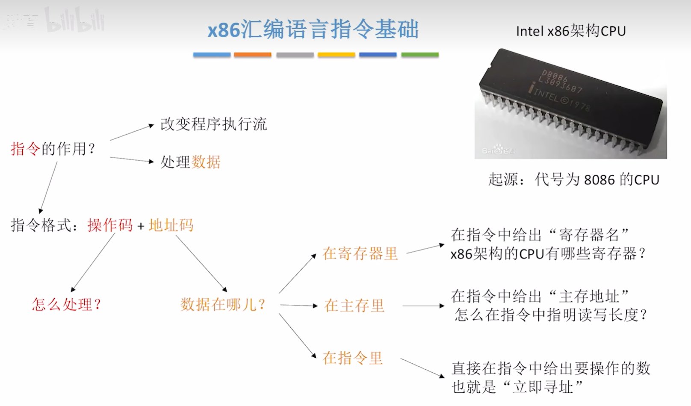

### 以 mov 指令为例

下面以 mov 指令为例来探讨。

图中所有用蓝色标注的都是寄存器，用紫色标注的是立即数，用绿色标注的外面还打了中括号`[]`表示一个内存地址，内存地址的红色前缀指明了内存的读写长度，也就是要读写几个字节。

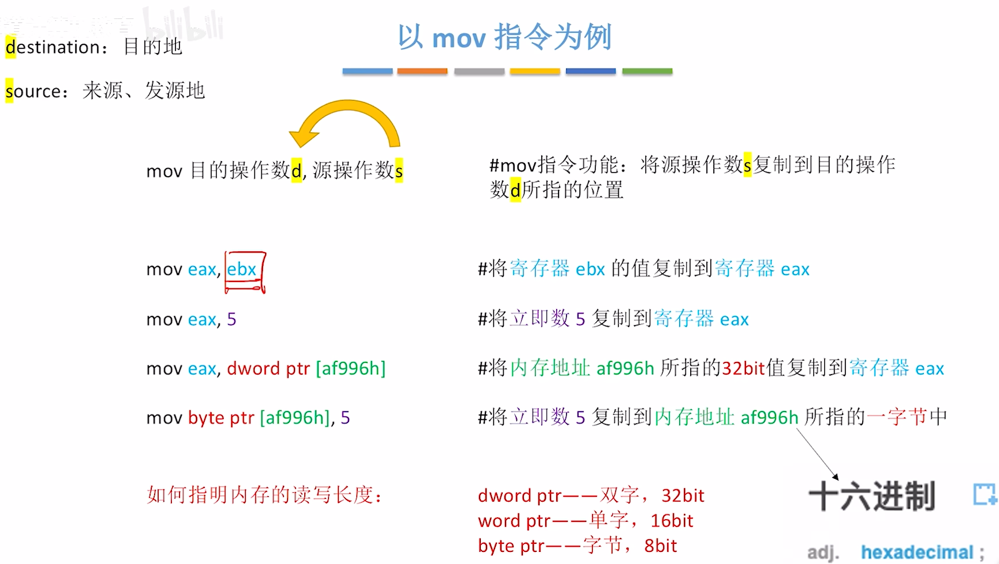

:::note
内存地址通常是16进制表示的，因此结尾是"h"。

当汇编语言中出现中括号时，通常表示的是一个内存地址。

中括号的前边会指明此次要读或者要写的长度。

长度只有可能出现图中的这三种情况（dword,word,byte）。

d(double)word = 32bit
word = 16bit
byte = 8bit
:::

### x86架构CPU有哪些寄存器

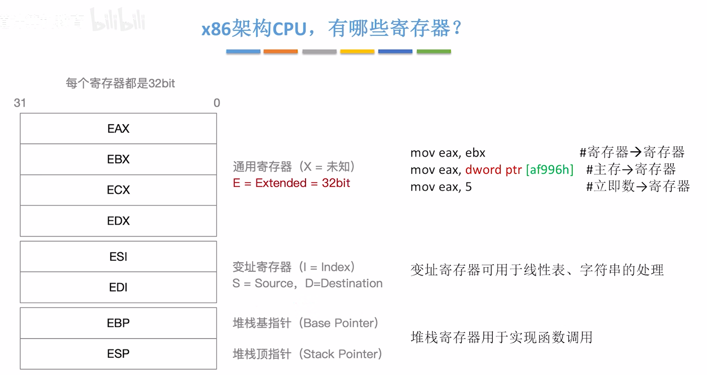

那怎么判断某一串字母指的是寄存器呢？

答案是：**以e开头的单词通常就是寄存器**。

一般来说，寄存器的使用都会涉及`32bit`，但通用寄存器**比较灵活**，可以使用更少的比特，`16bit`或`8bit`。 

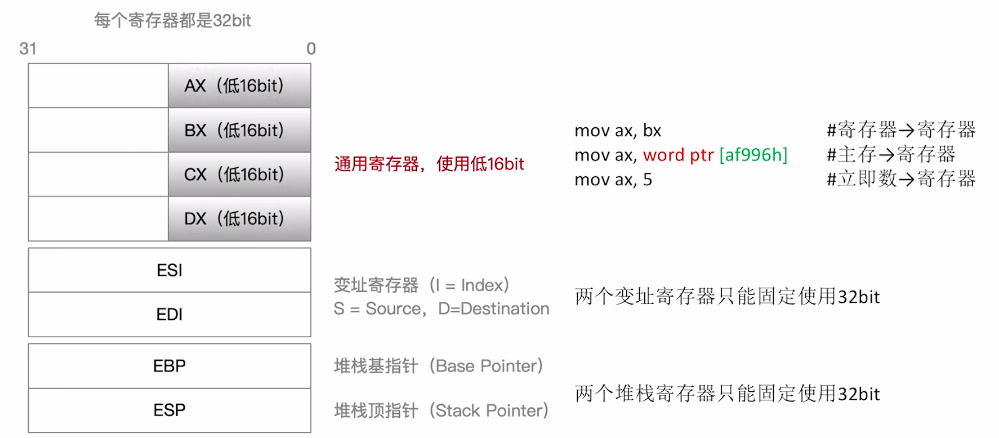

move ax, bx就是把bx里面的数据复制到ax当中。
 
更常见的还是直接使用32个比特。

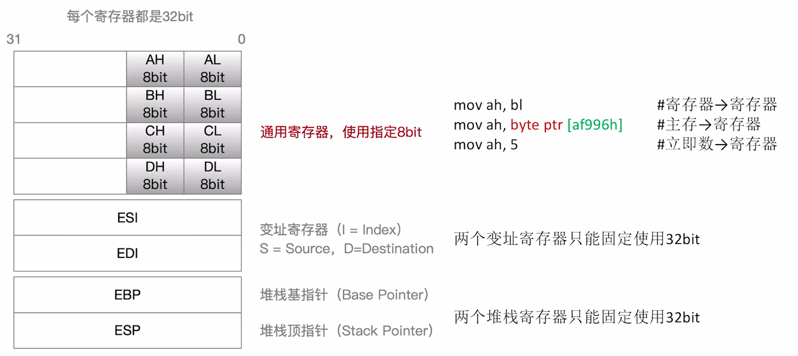

### 更多例子

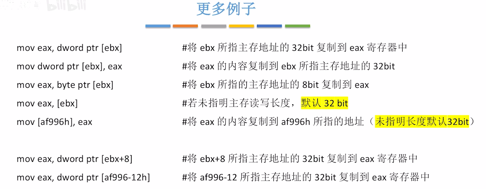

###  知识回顾

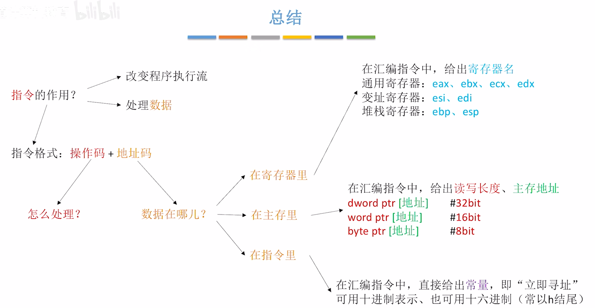

<iframe width="100%" height="468" src="//player.bilibili.com/player.html?isOutside=true&aid=995248168&bvid=BV1ps4y1d73V&cid=1100486048&p=52" crolling="no" border="0" frameborder="no" framespacing="0" allowfullscreen="true"></iframe>

知道数据在哪儿后，接下来我们讨论数据应该怎么处理。

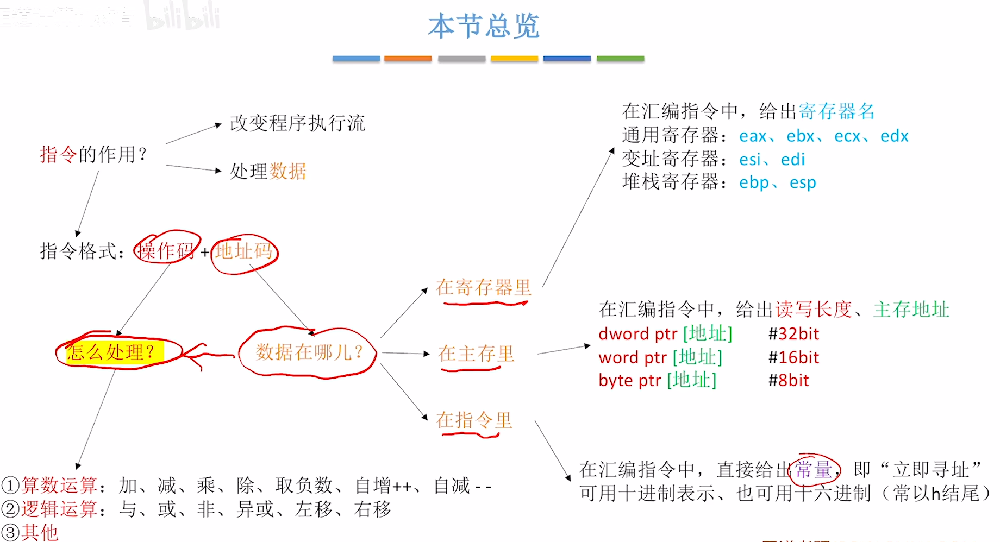

###  算术运算指令

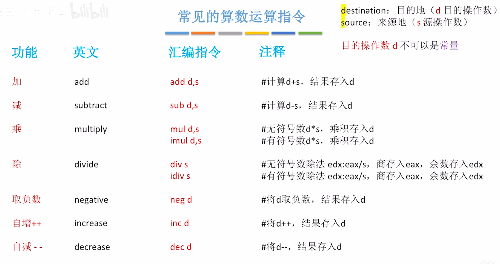

在除法指令中，s指的是除数，而被除数会被提前放到edx和eax两个寄存器当中。所以除法指令的被除数其实采用了**隐含寻址**。

可以看出，左边的目的操作数d不能是常数，因为我们要把得到的结果存放到左边操作数所在的位置。

edx:eax的意思是连起来存放拓展为64位的被除数。

另外，在x86中不允许两个操作数都同时来自主存。因此两个操作数要么同时来自于寄存器，要么一个在寄存器，一个在主存。

目的是为了保证每条指令不访问太多次主存。因为访问主存的次数越多，这条指令的执行速度会越慢。

###  逻辑运算指令

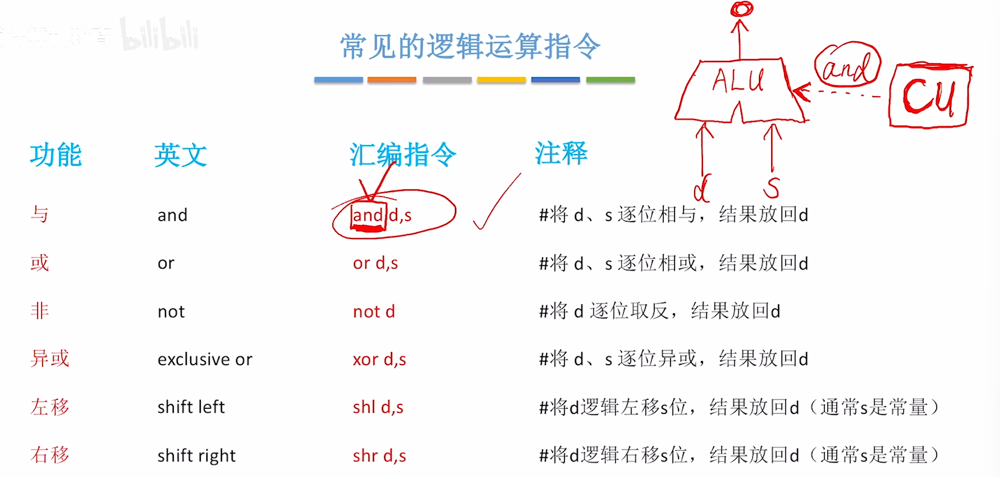

同样，左边的操作数d不能是常数。

回顾之前的知识，对于CPU的内部控制单元（CU）会依次执行这些指令，当CU确定这条指令所对应的功能后，就会给算术逻辑单元（ALU）发送与这条指令相对应的控制信号，d和s两个操作数就会被分别送到ALU的两个输入端。现在，CU又给ALU发来了和运算相关的控制信号，ALU就会把运算的结果从输出端输出。

这就是执行一条指令的原理。

### 其他指令

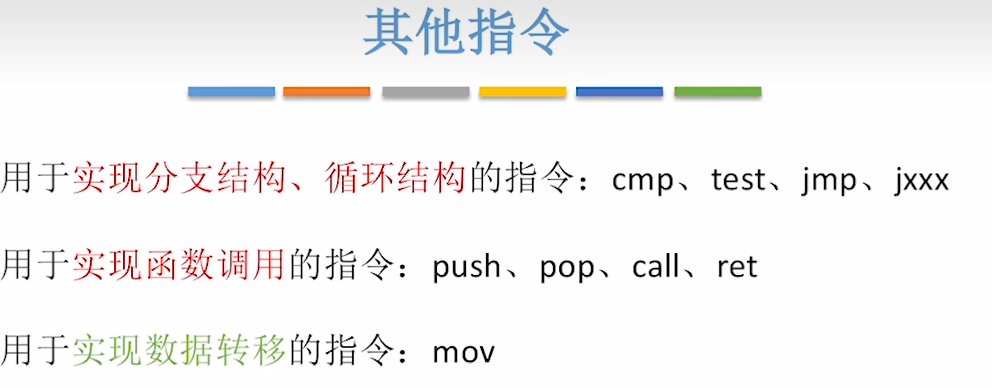

mov 已学过，剩下两种指令之后讲到分支循环和函数调用后学习。

