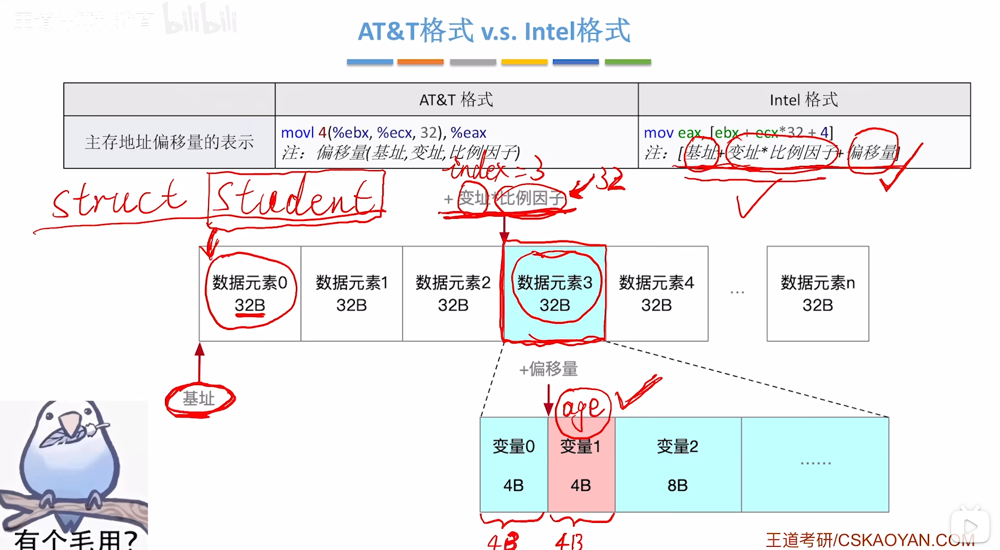

<iframe width="100%" height="468" src="//player.bilibili.com/player.html?isOutside=true&aid=995248168&bvid=BV1ps4y1d73V&cid=1100485778&p=51" crolling="no" border="0" frameborder="no" framespacing="0" allowfullscreen="true"></iframe>

- ## x86汇编语言指令基础
    - mov 指令
    - 算术运算指令
    - 逻辑运算指令
    - 其他指令

---

###  知识回顾

---

