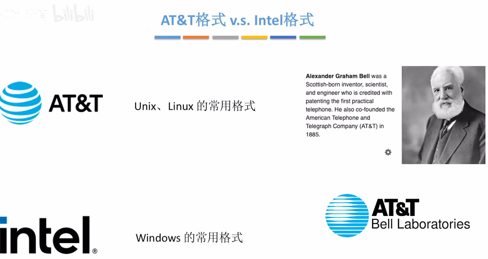
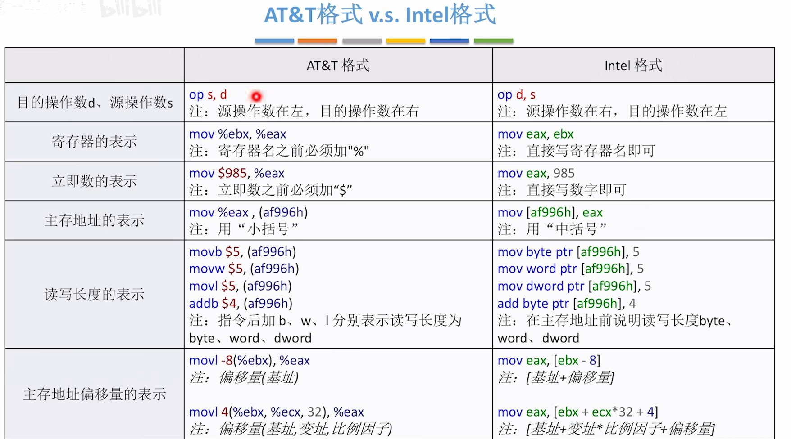

<iframe width="100%" height="468" src="//player.bilibili.com/player.html?isOutside=true&aid=995248168&bvid=BV1ps4y1d73V&cid=1100486140&p=53" crolling="no" border="0" frameborder="no" framespacing="0" allowfullscreen="true"></iframe>

上一篇博客中我们学习了x86的Intel格式，这篇我们来看看AT&T格式有什么不同。

最大的不同：d和s的位置相反！

比例因子意味着结构体的存储大小，变址意味着结构体的索引index，以此可以找到某个结构体中的某个变量。

:::tip
看到$，%，小括号( )，这些符号时应该想到这是AT&T格式。
:::

