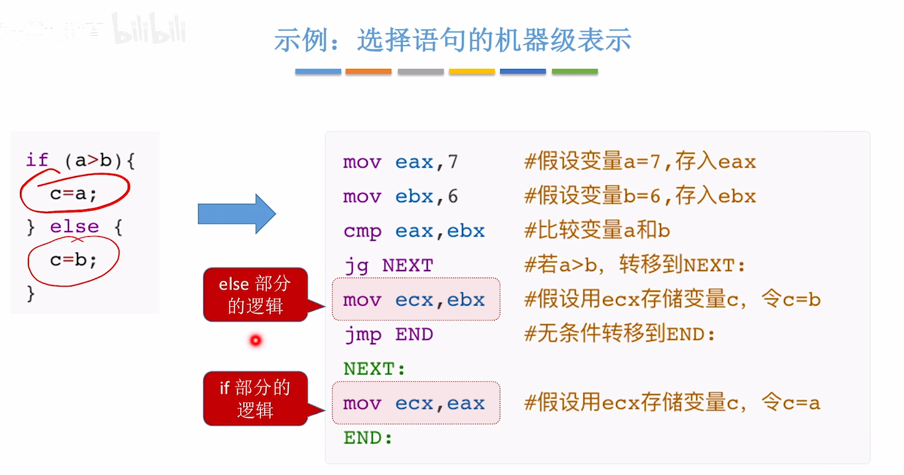

<iframe width="100%" height="468" src="//player.bilibili.com/player.html?isOutside=true&aid=995248168&bvid=BV1ps4y1d73V&cid=1100485998&p=54"  crolling="no" border="0" frameborder="no" framespacing="0" allowfullscreen="true"></iframe>

## 选择语句的机器级表示

怎么使用汇编语言来实现选择语句，也就是if-else这种分支结构的程序呢？

我们知道，指令是存储在主存里面的。

CPU会一条一条取出这些指令并执行，而CPU内部有一个比较特别的寄存器，叫做**程序计数器**（PC）。

这个寄存器的作用是会指向下一条即将执行的指令所存储的地址。

在x86处理器中，PC通常被称为IP（Instruction Pointer）。

但是选择语句并不像PC自动+1+1那样一条条往下进行的，可能会跳过某些语句，转而执行后面的这些语句。

这是C语言的视角。

那么在汇编语言的视角中如何实现这种程序执行流的跳转呢？

这就需要用到转移类的指令。

### 无条件转移指令——jmp

如果用jmp指令，意味着程序员必须要知道接下来跳转的指令放到内存里面之后，是被存储在什么地址。

然而这是非常困难的，如果只使用这三种方法来写jmp指令的话。

因此为了解决这个问题，可以使用这样的方式来书写jmp指令。

也就是用“标号”的方式实现跳转。

类似于C语言里面的goto语句，只要执行这条指令，PC是一定会跳转的，不用判断任何条件。

  

### 条件转移指令——jxxx

显然，无条件转移指令无法用于实现我们熟悉的if else语句。

因此需要使用cmp指令来配合条件转移指令。

### 示例：选择语句的机器级表示

可以看出，是先写else里面的内容，再写if里面的内容，与C语言相反。

也可以把`jg`变成`jle`，即通过命题取反的形式，达到先if后else的效果。

写汇编语言代码时，一般会以函数名作为“标号”，标注该函数指令的起始地址。

图中的f1指的就是这个函数，也就是第一条指令，函数的起始地址。

### 扩展：cmp指令的底层原理

 cmp的本质就是进行了一个减法，然后条件转移指令再根据减法所产生的标志位，去判断是否满足这条指令所对应的条件，以此去判断是否发生转移。

 CPU执行jne的本质就是在PSW中看一下ZF标志位是否等于0。

<iframe width="100%" height="468" src="//player.bilibili.com/player.html?isOutside=true&aid=995248168&bvid=BV1ps4y1d73V&cid=1100486538&p=55"  crolling="no" border="0" frameborder="no" framespacing="0" allowfullscreen="true"></iframe>

## 循环语句的机器级表示

### 用条件转移指令实现循环

用条件转移指令其实就可以实现循环。注意四个步骤。

### 用loop 指令实现循环

ecx的一个特殊功能就是作为**循环计数器**，所以不可以用eax，ebx这些其他的寄存器来代替ecx。
 
loop指令默认指定了对ecx进行--。

因此如果要使用loop指令，肯定需要配合着使用ecx这个寄存器，用ecx里的值来判断是否还需要继续循环。

