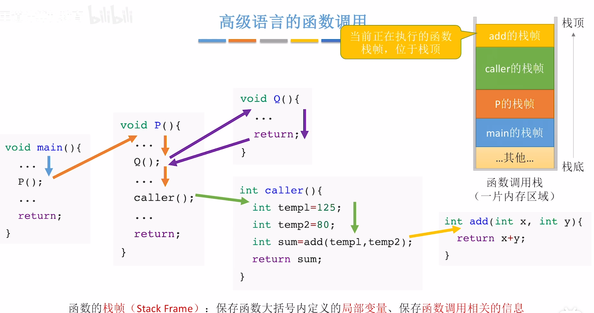
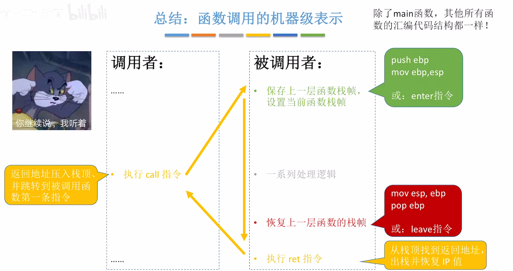
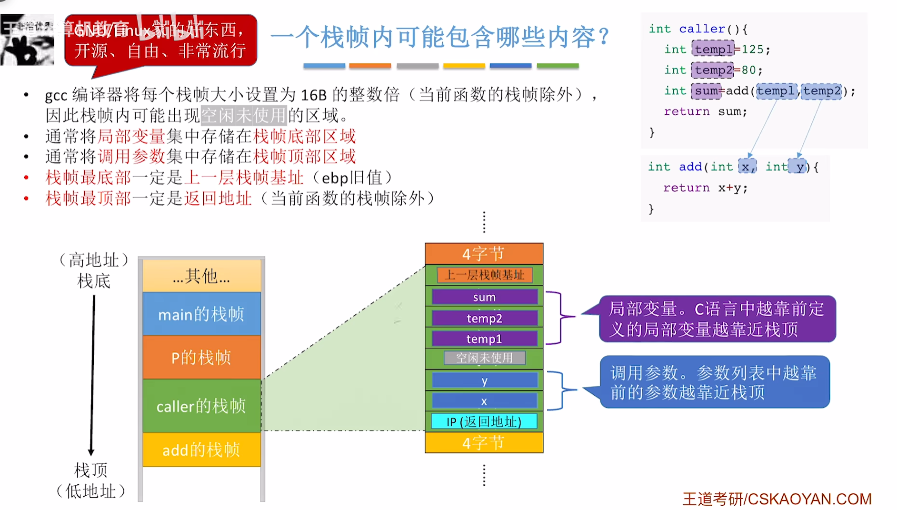

<iframe width="100%" height="468" src="//player.bilibili.com/player.html?isOutside=true&aid=995248168&bvid=BV1ps4y1d73V&cid=1110329000&p=56"  crolling="no" border="0" frameborder="no" framespacing="0" allowfullscreen="true"></iframe>

## call 和 return 指令

我们知道当函数运行的时候，系统会为它分配一片内存区域，这片区域被称为**函数调用栈**。

顾名思义，这片内存区域会用于实现函数调用。

这篇博客中我们将探讨汇编语言视角中是如何实现函数调用 的。

让我们把目光聚焦于`call`和`add`这两个函数。

这两个函数所对应的x86汇编语言如图。

:::note
在汇编语言中，通常用**标号**去标记一个函数的开始。
::: 

由于 call 和 return 指令都会使得程序的执行流发生改变，因此这两条指令肯定会影响PC寄存器的值。

要保证IP的值过得去，也回得来。首先会把IP寄存器里的旧址压栈保存，然后才会根据标号指明的位置进行无条件转移，让IP寄存器转移到被调用函数的第一条指令。当被调用函数执行完后，return 指令会从栈顶的位置取出刚才保存的这个IP旧址，把这个值写回IP寄存器。

不过，函数调用的时候通常会传入参数。同时，一个函数返回的时候，可能会有一个返回值。

显然 call 和 return 指令不可以直接带参数，也不可以直接带返回值。

那么参数和返回值是如何被传递的呢？

另外，如何访问栈帧里面的数据？

每一个栈帧里面到底包含哪些内容呢？

此外，为何这个图的栈要倒过来画？

## 如何调用栈帧

<iframe width="100%" height="468" src="//player.bilibili.com/player.html?isOutside=true&aid=995248168&bvid=BV1ps4y1d73V&cid=1110328747&p=57"  crolling="no" border="0" frameborder="no" framespacing="0" allowfullscreen="true"></iframe>

本节回答两个问题：

1. 栈为什么倒过来了？

2. 如何访问栈帧里的数据？

### 栈为什么倒过来了？

对于一个32位的操作系统来说，系统会为每一个进程分配`4GB`的虚拟地址空间，也就是虚拟内存。

地址的范围从`0000 0000`一直到`FFFF FFFF`，总共4GB。

高地址的这1GB属于操作系统的内核区，低地址的3GB可以由用户进程使用。

函数调用栈的栈底在`C000 0000`这个地址，而栈顶是在地址变小的这个方向。

因此大多数教材在画函数调用栈的时候会把栈底画在上方，因为上面是高地址方向。 

在3GB的函数调用栈中，还会划分其他的区域用于存储不同数据。

怎么用汇编语言指令在操作栈里的数据？

## 如何访问栈帧里的数据？

### 标记栈帧范围：EBP、ESP寄存器

我们知道在x86中有这样的常规寄存器，其中EBP和ESP这两个寄存器和我们的函数调用栈息息相关。

EBP寄存器用于存储栈帧基指针，也就是指向当前正在运行的这个函数的栈帧的底部。

ESP寄存器用于存储栈帧顶指针，也就是指向当前正在运行的这个函数的栈帧的顶部。

:::warning
注意：在一个CPU内部只有一个EBP和一个ESP。 
:::

两者中间的部分即为当前正在执行函数的栈帧范围。

:::note
x86系统中，默认以4字节为栈的操作单位。
:::

当 add 函数执行完后，ebp和esp就做了相应的修改，分别指向 caller 函数的顶部4字节和底部4字节。

这两个寄存器里面存储的本质是2个内存地址。

那怎么用汇编语言指令结合这两个内存地址对栈里的数据进行读或者写呢？

### 访问栈帧数据：push、pop 指令

以下五条指令演示了 push 和 pop 的执行过程。

① esp-4，eax的数据211压栈。

② esp-4，立即数985压栈。

③ esp-4，[ebp+8]里面的数据666复制一份压栈。

④ 栈顶元素666出栈，数据复制到eax。

⑤ 栈顶元素985出栈，数据复制到[ebp+8]。

push 和 pop 指令只能对栈顶位置进行读或写，使得当我们想要访问栈的其他位置时恨不方便。

有没有更灵活的方法可以让我们访问到栈的其他位置呢？

### 访问栈帧数据：mov 指令

可以使用加法指令 add 或减法指令 sub 对esp里的地址值进行修改，这是被允许的。

### 总结

## 如何切换栈帧

<iframe width="100%" height="468" src="//player.bilibili.com/player.html?isOutside=true&aid=995248168&bvid=BV1ps4y1d73V&cid=1110329000&p=56"  crolling="no" border="0" frameborder="no" framespacing="0" allowfullscreen="true"></iframe>

### enter 指令

当函数执行完毕后，我们需要改变ebp和esp的位置，让其重新指回上一层函数的栈帧。

如图所示，call 指令执行函数的第一步，将IP内的值压栈保存。

由于IP的作用相当于PC，存储的就是下一条语句的地址，因此IP旧值就是返回的地址。

到函数后，执行 push ebp，把ebp寄存器里的值压到栈顶。

ebp此时指向的地址是`A00F 0030`，所以执行这条指令的效果就是把这个地址信息压栈保存到栈顶的位置。

接下来执行 mov ebp, esp，把esp寄存器里的值复制到ebp寄存器中。

也就是让ebp寄存器指向esp寄存器当前所指的地址`A00F 0010`。

可以看到，这两条指令更新了ebp和esp的指向。而这两条指令就等价于 enter 指令。

:::note
jmp + 标号，程序的执行流就会转移到这个标号所指明的位置。
:::

当 add 函数 return 返回之前，如何恢复esp和ebp的值呢？

### leave 指令

mov esp, ebp后，esp会和ebp同时指向当前栈帧的底部。

此时pop ebp，会把esp所指元素出栈，该元素`A00F 0030`也就是上一层函数的基址。

栈顶元素的值会被复制到ebp，也就是会让ebp的值等于`A00F 0010`，让ebp指针重新指回了caller函数的栈帧底部。

同时esp+4，指向`A00F 0014`。

:::note
pop ebp的意思是弹出esp内容并把内容送到ebp中。
:::

:::note
每个栈帧底部，用于保存上一层函数栈帧的基址。
:::

leave 指令是每个函数ret前的“例行处理”，与 enter相互对照。

### ret 指令

ret 指令会从函数的栈帧顶部（esp所指的位置）找到IP寄存器的旧值，取出并写到IP寄存器中。

也就是让程序的执行流回到 call 指令的后面。

 
### 总结

## 函数调用的机器级表示

<iframe width="100%" height="468" src="//player.bilibili.com/player.html?isOutside=true&aid=995248168&bvid=BV1ps4y1d73V&cid=1110341935&p=59"  crolling="no" border="0" frameborder="no" framespacing="0" allowfullscreen="true"></iframe>

### 一个函数栈帧包含哪些内容

### 汇编代码实战

注意 mov 指令不能同时在主存里面进行，因此要先mov [ebp-8], 80，再mov eax, [ebp-8]。

在 call 指令前，将调用参数写入栈帧顶部区域。

通常把返回值写到eax寄存器当中。

在 ret 指令前，将函数返回值写入eax寄存器。

### 总结

### 拓展：

假设在发生函数调用时，调用者有一些运算结果被存在某一些寄存器当中。当函数调用发生时，被调用者有可能会使用到这些寄存器，也就有可能把调用者的中间结果覆盖掉，导致数据的丢失。

如果有必要的话，应该在发起函数调用之前，就把所需要的寄存器值压栈保存，在函数调用返回之后再把寄存器的值从栈恢复到寄存器。

因此会把部分寄存器的值储存在栈帧的未使用区和调用参数之间。

因此具体情况具体分析，完整图如下。

## 函数调用机器级代码思维导图

