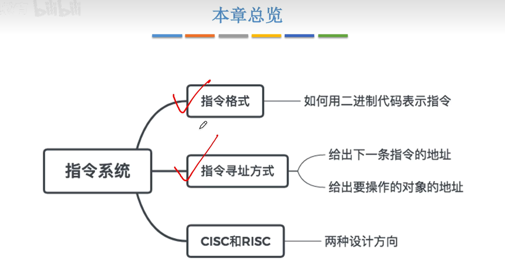
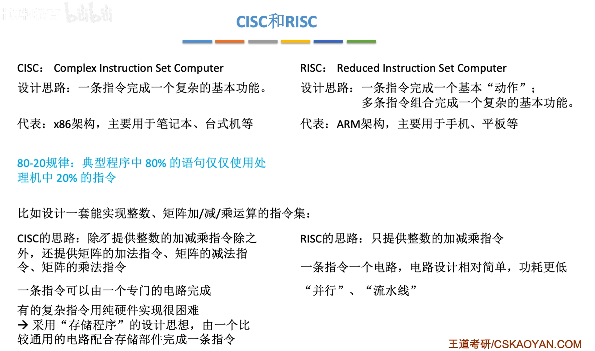

<iframe width="100%" height="468" src="//player.bilibili.com/player.html?isOutside=true&aid=995248168&bvid=BV1ps4y1d73V&cid=1100486713&p=60"  crolling="no" border="0" frameborder="no" framespacing="0" allowfullscreen="true"></iframe>

- ## 指令系统总览
    - 指令格式
    - 指令寻址方式
    - CISC和RISC

## CISC和RISC

CISC和RISC是指令系统的两种设计方向。

 

 

:::tip
乘法指令可以访存，一定是CISC。

因为RISC只能通过Load/Store访问主存。
:::

因此CISC只需要较少的寄存器，比如乘法指令会直接把需要相乘的数取到某一个寄存器，紧接着就完成乘法操作，不会过多地占用寄存器。

而对于RISC，不论是加减乘除什么运算，一定需要一条指令先把数据从主存读入某一个寄存器，然后再进行运算操作。

目标代码可以类比成C语言库函数和简单语法的关系。CISC使用库函数（微程序），若微程序设计不好或不适用，则效率不高。而RISC则只使用简单语法，因此效率会很高。

控制方式将在第五章中学习，微程序控制效率比组合逻辑低。

最后，由于CISC中各种指令执行时间相差较大，因此指令流水线的实现会比较困难。而RISC中所有指令几乎都在一个周期内完成，因此可以很方便地实现指令流水线，使得CPU整体效率得到质的飞跃，RISC当中指令流水线都是必须实现的。

