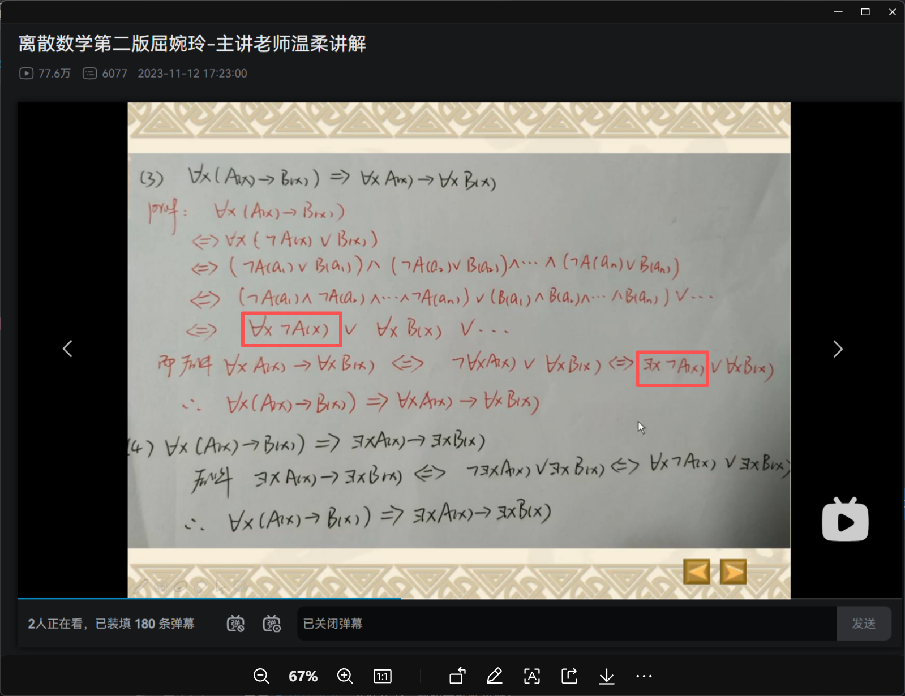

<iframe width="100%" height="468" src="//player.bilibili.com/player.html?isOutside=true&aid=280758103&bvid=BV1Vc411X7nr&cid=1329937256&p=60"  crolling="no" border="0" frameborder="no" framespacing="0" allowfullscreen="true"></iframe>

- ## 微程序控制器的基本原理

  - CPU的功能和结构
  - 指令执行过程

## 微程序控制器的设计思路

其中，运算器主要负责对数据进行处理，也就是算术运算和逻辑运算。

控制器由①CU ②IR ③PC，三个部分组成。

除此之外也有其他一些重要的寄存器。

在控制单元的指挥之下，CPU会执行一系列的指令序列。

每一条指令的执行分为①取指令②分析指令③执行指令，这样的三个部分。

:::note
CPU工作的过程，就是执行一条条指令的过程。
:::
